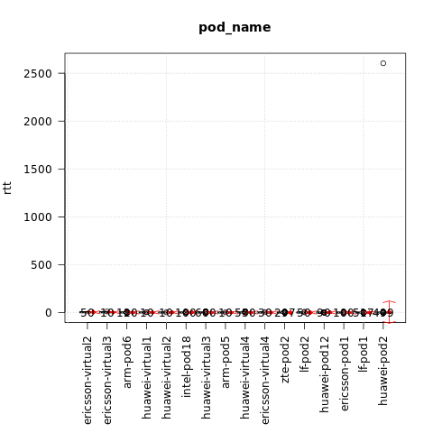

.. This work is licensed under a Creative Commons Attribution 4.0 International
.. License.
.. http://creativecommons.org/licenses/by/4.0

======================================
Test results for TC002 network latency
======================================

.. toctree::
   :maxdepth: 2

Overview of test case
=====================

TC002 verifies that network latency is within acceptable boundaries when packets travel between hosts located on same or different compute blades.
Ping packets (ICMP protocol's mandatory ECHO_REQUEST datagram) are sent from host VM to target VM(s) to elicit ICMP ECHO_RESPONSE.

Metric: RTT (Round Trip Time)
Unit: ms

Euphrates release
-----------------

Test results per scenario and pod (lower is better):

{

    "os-nosdn-ovs_dpdk-ha:huawei-pod2:compass": [0.214],

    "os-odl_l2-moon-ha:huawei-pod2:compass": [0.309],

    "os-nosdn-ovs_dpdk-noha:huawei-virtual3:compass": [0.3145],

    "os-nosdn-ovs-ha:lf-pod2:fuel": [0.3585],

    "os-odl_l3-nofeature-ha:huawei-pod2:compass": [0.3765],

    "os-nosdn-ovs_dpdk-noha:huawei-virtual4:compass": [0.403],

    "os-odl-sfc-ha:huawei-pod2:compass": [0.413],

    "os-nosdn-ovs-ha:ericsson-pod1:fuel": [0.494],

    "os-nosdn-nofeature-ha:lf-pod1:apex": [0.5715],

    "os-nosdn-nofeature-noha:lf-pod1:apex": [0.5785],

    "os-odl-sfc-ha:lf-pod1:apex": [0.617],

    "os-odl-nofeature-ha:lf-pod1:apex": [0.62],

    "os-nosdn-bar-noha:lf-pod1:apex": [0.632],

    "os-odl-nofeature-noha:lf-pod1:apex": [0.635],

    "os-odl-bgpvpn-ha:lf-pod1:apex": [0.658],

    "os-odl-sfc-noha:lf-pod1:apex": [0.663],

    "os-nosdn-bar-ha:lf-pod1:apex": [0.668],

    "os-ovn-nofeature-noha:lf-pod1:apex": [0.668],

    "os-nosdn-nofeature-ha:huawei-pod2:compass": [0.6815],

    "os-nosdn-kvm-ha:huawei-pod2:compass": [0.7005],

    "os-nosdn-bar-ha:huawei-pod2:compass": [0.778],

    "os-nosdn-ovs-noha:ericsson-virtual4:fuel": [0.7825],

    "os-nosdn-ovs-noha:ericsson-virtual2:fuel": [0.7885],

    "os-nosdn-nofeature-ha:flex-pod2:apex": [0.795],

    "os-nosdn-ovs-noha:ericsson-virtual1:fuel": [0.8045],

    "os-nosdn-nofeature-noha:huawei-pod12:joid": [0.8335],

    "os-nosdn-ovs-noha:ericsson-virtual3:fuel": [0.8755],

    "os-nosdn-nofeature-ha:huawei-pod12:joid": [0.8855],

    "os-nosdn-ovs_dpdk-ha:huawei-virtual3:compass": [0.8895],

    "os-nosdn-openbaton-ha:huawei-pod12:joid": [0.901],

    "os-nosdn-ovs_dpdk-ha:huawei-virtual4:compass": [0.956],

    "os-nosdn-lxd-noha:intel-pod5:joid": [1.131],

    "os-odl_l2-moon-noha:huawei-virtual4:compass": [1.173],

    "os-odl-sfc-ha:huawei-virtual8:compass": [1.2015],

    "os-odl_l2-moon-noha:huawei-virtual3:compass": [1.204],

    "os-nosdn-lxd-ha:intel-pod5:joid": [1.2245],

    "os-odl-nofeature-ha:lf-pod2:fuel": [1.2285],

    "os-odl-sfc-noha:huawei-virtual4:compass": [1.3055],

    "os-nosdn-nofeature-noha:huawei-virtual4:compass": [1.309],

    "os-odl_l3-nofeature-noha:huawei-virtual4:compass": [1.313],

    "os-nosdn-nofeature-noha:huawei-virtual8:compass": [1.319],

    "os-odl-nofeature-ha:ericsson-pod1:fuel": [1.3425],

    "os-odl_l3-nofeature-noha:huawei-virtual3:compass": [1.3475],

    "os-nosdn-nofeature-ha:lf-pod2:fuel": [1.348],

    "os-nosdn-kvm-noha:huawei-virtual4:compass": [1.432],

    "os-odl_l3-nofeature-noha:huawei-virtual9:compass": [1.442],

    "os-nosdn-nofeature-ha:ericsson-pod1:fuel": [1.4505],

    "os-nosdn-nofeature-ha:arm-pod5:fuel": [1.497],

    "os-odl-sfc-noha:huawei-virtual3:compass": [1.504],

    "os-odl-nofeature-ha:arm-pod5:fuel": [1.519],

    "os-nosdn-nofeature-noha:intel-pod5:joid": [1.5415],

    "os-nosdn-nofeature-noha:huawei-virtual3:compass": [1.5785],

    "os-nosdn-nofeature-ha:intel-pod5:joid": [1.604],

    "os-nosdn-kvm-noha:huawei-virtual3:compass": [1.61],

    "os-nosdn-nofeature-noha:intel-pod18:joid": [1.633],

    "os-nosdn-openbaton-ha:intel-pod18:joid": [1.6485],

    "os-odl_l3-nofeature-ha:huawei-virtual2:compass": [1.7085],

    "os-nosdn-nofeature-ha:intel-pod18:joid": [1.71],

    "os-nosdn-nofeature-ha:huawei-virtual2:compass": [1.7955],

    "os-odl-nofeature-ha:arm-pod6:fuel": [1.838],

    "os-odl_l3-nofeature-ha:huawei-virtual4:compass": [1.88],

    "os-odl_l2-moon-ha:huawei-virtual3:compass": [1.8975],

    "os-nosdn-kvm-noha:huawei-virtual8:compass": [1.923],

    "os-odl_l2-moon-ha:huawei-virtual4:compass": [1.944],

    "os-odl-sfc-ha:huawei-virtual3:compass": [1.968],

    "os-odl_l3-nofeature-ha:huawei-virtual3:compass": [1.986],

    "os-nosdn-bar-ha:huawei-virtual4:compass": [2.0415],

    "os-nosdn-nofeature-ha:huawei-virtual4:compass": [2.071],

    "os-nosdn-nofeature-ha:arm-pod6:fuel": [2.0855],

    "os-odl-sfc-ha:huawei-virtual4:compass": [2.1085],

    "os-nosdn-nofeature-ha:huawei-virtual3:compass": [2.1135],

    "os-nosdn-nofeature-noha:ericsson-virtual3:fuel": [2.234],

    "os-nosdn-nofeature-ha:huawei-virtual9:compass": [2.294],

    "os-nosdn-kvm-ha:huawei-virtual3:compass": [2.304],

    "os-nosdn-bar-ha:huawei-virtual3:compass": [2.378],

    "os-nosdn-kvm-ha:huawei-virtual4:compass": [2.397],

    "os-nosdn-nofeature-ha:huawei-virtual1:compass": [2.472],

    "os-nosdn-nofeature-noha:huawei-virtual1:compass": [2.603],

    "os-nosdn-nofeature-noha:huawei-virtual2:compass": [2.635],

    "os-odl-nofeature-noha:ericsson-virtual3:fuel": [2.9055],

    "os-odl-nofeature-noha:ericsson-virtual2:fuel": [3.1295],

    "os-nosdn-nofeature-noha:ericsson-virtual2:fuel": [3.337],

    "os-odl-nofeature-noha:ericsson-virtual4:fuel": [3.634],

    "os-nosdn-nofeature-noha:ericsson-virtual1:fuel": [3.875],

    "os-odl-nofeature-noha:ericsson-virtual1:fuel": [3.9655],

    "os-nosdn-nofeature-noha:ericsson-virtual4:fuel": [3.9795]

}

The influence of the scenario
^^^^^^^^^^^^^^^^^^^^^^^^^^^^^

{

    "os-odl_l2-moon-ha": [0.3415],

    "os-nosdn-ovs-ha": [0.3625],

    "os-nosdn-ovs_dpdk-noha": [0.378],

    "os-nosdn-ovs_dpdk-ha": [0.5265],

    "os-nosdn-bar-noha": [0.632],

    "os-odl-bgpvpn-ha": [0.658],

    "os-ovn-nofeature-noha": [0.668],

    "os-odl_l3-nofeature-ha": [0.8545],

    "os-nosdn-ovs-noha": [0.8575],

    "os-nosdn-bar-ha": [0.903],

    "os-odl-sfc-ha": [1.127],

    "os-nosdn-lxd-noha": [1.131],

    "os-nosdn-nofeature-ha": [1.152],

    "os-odl_l2-moon-noha": [1.1825],

    "os-nosdn-lxd-ha": [1.2245],

    "os-odl_l3-nofeature-noha": [1.337],

    "os-odl-nofeature-ha": [1.352],

    "os-odl-sfc-noha": [1.4255],

    "os-nosdn-kvm-noha": [1.5045],

    "os-nosdn-openbaton-ha": [1.5665],

    "os-nosdn-nofeature-noha": [1.729],

    "os-nosdn-kvm-ha": [1.7745],

    "os-odl-nofeature-noha": [3.106]

}

The influence of the POD
^^^^^^^^^^^^^^^^^^^^^^^^

{

    "huawei-pod2": [0.3925],

    "lf-pod2": [0.5315],

    "lf-pod1": [0.62],

    "flex-pod2": [0.795],

    "huawei-pod12": [0.87],

    "intel-pod5": [1.25],

    "ericsson-virtual3": [1.2655],

    "ericsson-pod1": [1.372],

    "arm-pod5": [1.518],

    "huawei-virtual4": [1.5355],

    "huawei-virtual3": [1.606],

    "intel-pod18": [1.6575],

    "huawei-virtual8": [1.709],

    "huawei-virtual2": [1.872],

    "arm-pod6": [1.895],

    "huawei-virtual9": [2.0745],

    "huawei-virtual1": [2.495],

    "ericsson-virtual2": [2.7895],

    "ericsson-virtual4": [3.768],

    "ericsson-virtual1": [3.8035]

}

Fraser release
--------------

Test results per scenario and pod (lower is better):

{

    "os-odl_l3-nofeature-ha:huawei-pod2:compass": [0.42],

    "os-odl-sfc-ha:huawei-pod2:compass": [0.557],

    "os-nosdn-ovs-ha:ericsson-pod1:fuel": [0.5765],

    "os-nosdn-kvm-ha:huawei-pod2:compass": [0.582],

    "os-odl-bgpvpn-ha:lf-pod1:apex": [0.678],

    "os-nosdn-nofeature-ha:lf-pod1:apex": [0.7075],

    "os-nosdn-calipso-noha:lf-pod1:apex": [0.713],

    "os-nosdn-nofeature-noha:lf-pod1:apex": [0.7155],

    "os-nosdn-bar-ha:lf-pod1:apex": [0.732],

    "os-nosdn-bar-noha:lf-pod1:apex": [0.7415],

    "os-odl-nofeature-noha:lf-pod1:apex": [0.7565],

    "os-nosdn-ovs-ha:arm-pod6:fuel": [0.8015],

    "os-nosdn-nofeature-ha:huawei-pod2:compass": [0.908],

    "os-odl-nofeature-ha:ericsson-pod1:fuel": [0.9165],

    "os-nosdn-bar-ha:huawei-pod2:compass": [0.969],

    "os-nosdn-ovs-noha:ericsson-virtual2:fuel": [0.9765],

    "os-nosdn-nofeature-noha:huawei-pod12:joid": [1.0245],

    "os-nosdn-nofeature-ha:huawei-pod12:joid": [1.0495],

    "os-odl-sfc-noha:huawei-virtual4:compass": [1.1645],

    "os-nosdn-nofeature-ha:lf-pod2:fuel": [1.206],

    "os-odl-sfc-noha:huawei-virtual3:compass": [1.236],

    "os-nosdn-ovs-noha:ericsson-virtual4:fuel": [1.241],

    "os-nosdn-nofeature-ha:zte-pod2:daisy": [1.2805],

    "os-odl-nofeature-ha:lf-pod2:fuel": [1.286],

    "os-odl_l3-nofeature-noha:huawei-virtual3:compass": [1.299],

    "os-odl-sfc-ha:huawei-virtual4:compass": [1.305],

    "os-odl_l3-nofeature-noha:huawei-virtual4:compass": [1.309],

    "os-nosdn-kvm-noha:huawei-virtual4:compass": [1.314],

    "os-nosdn-nofeature-noha:huawei-virtual4:compass": [1.431],

    "os-nosdn-nofeature-ha:ericsson-pod1:fuel": [1.457],

    "os-odl-nofeature-ha:zte-pod2:daisy": [1.517],

    "os-nosdn-kvm-noha:huawei-virtual3:compass": [1.576],

    "os-nosdn-nofeature-noha:huawei-virtual3:compass": [1.592],

    "os-odl-nofeature-ha:arm-pod5:fuel": [1.714],

    "os-nosdn-nofeature-noha:intel-pod18:joid": [1.809],

    "os-nosdn-bar-noha:huawei-virtual4:compass": [1.81],

    "os-nosdn-nofeature-ha:intel-pod18:joid": [1.8505],

    "os-nosdn-nofeature-ha:huawei-virtual4:compass": [1.8895],

    "os-nosdn-nofeature-ha:huawei-virtual3:compass": [1.909],

    "os-odl_l3-nofeature-ha:huawei-virtual4:compass": [1.925],

    "os-nosdn-nofeature-noha:huawei-virtual2:compass": [1.964],

    "os-nosdn-openbaton-ha:intel-pod18:joid": [1.9755],

    "os-nosdn-nofeature-ha:huawei-virtual1:compass": [1.9765],

    "os-nosdn-bar-noha:huawei-virtual3:compass": [1.9915],

    "os-odl_l3-nofeature-ha:huawei-virtual3:compass": [1.9925],

    "os-nosdn-kvm-ha:huawei-virtual4:compass": [2.0265],

    "os-odl-nofeature-ha:arm-pod6:fuel": [2.106],

    "os-odl-sfc-ha:huawei-virtual3:compass": [2.124],

    "os-nosdn-kvm-ha:huawei-virtual3:compass": [2.185],

    "os-nosdn-nofeature-ha:arm-pod6:fuel": [2.281],

    "os-nosdn-bar-ha:huawei-virtual4:compass": [2.432],

    "os-odl-nofeature-noha:ericsson-virtual4:fuel": [2.483],

    "os-nosdn-bar-ha:huawei-virtual3:compass": [2.524],

    "os-nosdn-nofeature-noha:ericsson-virtual3:fuel": [3.9175],

    "os-odl-nofeature-noha:ericsson-virtual2:fuel": [4.338],

    "os-nosdn-nofeature-noha:ericsson-virtual2:fuel": [4.641]

}

The influence of the scenario
^^^^^^^^^^^^^^^^^^^^^^^^^^^^^

{

    "os-odl-bgpvpn-ha": [0.678],

    "os-nosdn-calipso-noha": [0.713],

    "os-nosdn-ovs-ha": [0.7245],

    "os-odl_l3-nofeature-ha": [0.7435],

    "os-odl-sfc-ha": [0.796],

    "os-nosdn-kvm-ha": [1.059],

    "os-nosdn-bar-ha": [1.083],

    "os-nosdn-ovs-noha": [1.09],

    "os-odl-sfc-noha": [1.196],

    "os-nosdn-nofeature-noha": [1.26],

    "os-nosdn-nofeature-ha": [1.291],

    "os-odl_l3-nofeature-noha": [1.308],

    "os-nosdn-bar-noha": [1.4125],

    "os-nosdn-kvm-noha": [1.4475],

    "os-odl-nofeature-ha": [1.508],

    "os-odl-nofeature-noha": [1.914],

    "os-nosdn-openbaton-ha": [1.9755]

}

The influence of the POD
^^^^^^^^^^^^^^^^^^^^^^^^

{

    "huawei-pod2": [0.677],

    "lf-pod1": [0.725],

    "ericsson-pod1": [0.9165],

    "huawei-pod12": [1.0465],

    "lf-pod2": [1.2325],

    "zte-pod2": [1.395],

    "ericsson-virtual4": [1.582],

    "huawei-virtual4": [1.697],

    "arm-pod5": [1.714],

    "huawei-virtual3": [1.716],

    "intel-pod18": [1.856],

    "huawei-virtual2": [1.964],

    "huawei-virtual1": [1.9765],

    "arm-pod6": [2.209],

    "ericsson-virtual3": [3.9175],

    "ericsson-virtual2": [4.004]

}
