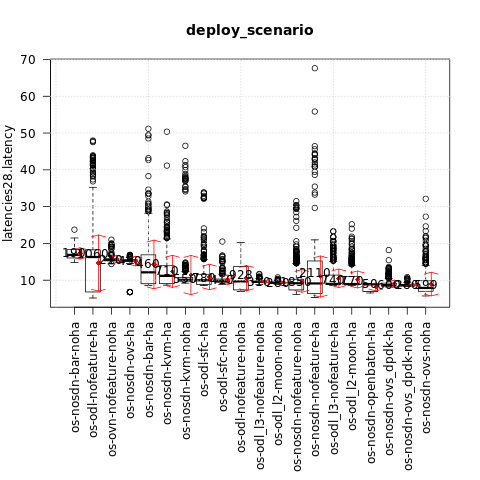
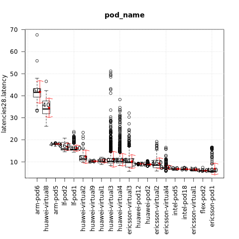

.. This work is licensed under a Creative Commons Attribution 4.0 International
.. License.
.. http://creativecommons.org/licenses/by/4.0

==========================================
Test results for TC010 memory read latency
==========================================

.. toctree::
   :maxdepth: 2

Overview of test case
=====================

TC010 measures the memory read latency for varying memory sizes and strides.
The test results shown below are for memory size of 16MB.

Metric: Memory read latency
Unit: ns

Euphrates release
-----------------

Test results per scenario and pod (lower is better):

{

    "os-nosdn-nofeature-ha:ericsson-pod1:fuel": [5.3165],

    "os-nosdn-nofeature-ha:flex-pod2:apex": [5.908],

    "os-nosdn-ovs-noha:ericsson-virtual1:fuel": [6.412],

    "os-nosdn-nofeature-noha:intel-pod18:joid": [6.545],

    "os-nosdn-nofeature-ha:intel-pod18:joid": [6.592],

    "os-nosdn-nofeature-noha:intel-pod5:joid": [6.5975],

    "os-nosdn-ovs-ha:ericsson-pod1:fuel": [6.7675],

    "os-odl-nofeature-ha:ericsson-pod1:fuel": [6.7675],

    "os-nosdn-openbaton-ha:intel-pod18:joid": [6.7945],

    "os-nosdn-nofeature-ha:intel-pod5:joid": [6.839],

    "os-nosdn-ovs-noha:ericsson-virtual4:fuel": [6.9695],

    "os-nosdn-nofeature-noha:ericsson-virtual4:fuel": [7.123],

    "os-odl-nofeature-noha:ericsson-virtual4:fuel": [7.289],

    "os-nosdn-ovs-noha:ericsson-virtual2:fuel": [7.4315],

    "os-nosdn-nofeature-noha:ericsson-virtual2:fuel": [7.9],

    "os-nosdn-ovs_dpdk-ha:huawei-pod2:compass": [8.178],

    "os-nosdn-ovs_dpdk-noha:huawei-virtual3:compass": [8.616],

    "os-nosdn-ovs_dpdk-noha:huawei-virtual4:compass": [8.646],

    "os-odl_l3-nofeature-ha:huawei-pod2:compass": [8.8615],

    "os-odl-sfc-ha:huawei-pod2:compass": [8.87],

    "os-nosdn-bar-ha:huawei-pod2:compass": [8.877],

    "os-odl_l2-moon-ha:huawei-pod2:compass": [8.892],

    "os-nosdn-ovs-noha:ericsson-virtual3:fuel": [8.898],

    "os-nosdn-nofeature-ha:huawei-pod2:compass": [8.952],

    "os-nosdn-kvm-ha:huawei-pod2:compass": [8.9745],

    "os-nosdn-ovs_dpdk-ha:huawei-virtual3:compass": [9.0375],

    "os-nosdn-openbaton-ha:huawei-pod12:joid": [9.083],

    "os-nosdn-nofeature-noha:huawei-pod12:joid": [9.09],

    "os-nosdn-nofeature-ha:huawei-pod12:joid": [9.094],

    "os-odl_l2-moon-noha:huawei-virtual4:compass": [9.293],

    "os-odl_l2-moon-noha:huawei-virtual3:compass": [9.3525],

    "os-odl-sfc-noha:huawei-virtual4:compass": [9.477],

    "os-odl_l3-nofeature-noha:huawei-virtual3:compass": [9.5445],

    "os-odl_l3-nofeature-noha:huawei-virtual4:compass": [9.5575],

    "os-nosdn-nofeature-noha:huawei-virtual4:compass": [9.6435],

    "os-nosdn-nofeature-noha:huawei-virtual1:compass": [9.68],

    "os-nosdn-ovs_dpdk-ha:huawei-virtual4:compass": [9.728],

    "os-nosdn-nofeature-noha:huawei-virtual3:compass": [9.751],

    "os-nosdn-nofeature-noha:ericsson-virtual3:fuel": [9.8645],

    "os-nosdn-kvm-noha:huawei-virtual3:compass": [9.969],

    "os-odl-sfc-noha:huawei-virtual3:compass": [10.029],

    "os-nosdn-kvm-noha:huawei-virtual4:compass": [10.088],

    "os-odl-nofeature-noha:ericsson-virtual2:fuel": [10.2985],

    "os-nosdn-nofeature-ha:huawei-virtual9:compass": [10.318],

    "os-nosdn-nofeature-noha:huawei-virtual2:compass": [10.3215],

    "os-nosdn-nofeature-ha:huawei-virtual4:compass": [10.617],

    "os-odl-nofeature-noha:ericsson-virtual3:fuel": [10.762],

    "os-nosdn-bar-ha:huawei-virtual3:compass": [10.7715],

    "os-nosdn-nofeature-ha:huawei-virtual1:compass": [10.866],

    "os-odl-sfc-ha:huawei-virtual3:compass": [10.871],

    "os-odl_l3-nofeature-ha:huawei-virtual3:compass": [11.1605],

    "os-nosdn-nofeature-ha:huawei-virtual3:compass": [11.227],

    "os-nosdn-bar-ha:huawei-virtual4:compass": [11.348],

    "os-odl-sfc-ha:huawei-virtual4:compass": [11.453],

    "os-odl_l3-nofeature-ha:huawei-virtual2:compass": [11.571],

    "os-odl_l2-moon-ha:huawei-virtual3:compass": [11.5925],

    "os-nosdn-nofeature-ha:huawei-virtual2:compass": [11.689],

    "os-odl_l2-moon-ha:huawei-virtual4:compass": [11.8695],

    "os-odl_l3-nofeature-ha:huawei-virtual4:compass": [12.199],

    "os-nosdn-kvm-ha:huawei-virtual4:compass": [12.433],

    "os-nosdn-kvm-ha:huawei-virtual3:compass": [12.713],

    "os-nosdn-ovs-ha:lf-pod2:fuel": [15.328],

    "os-odl-nofeature-ha:lf-pod1:apex": [15.4265],

    "os-odl-nofeature-noha:lf-pod1:apex": [15.428],

    "os-ovn-nofeature-noha:lf-pod1:apex": [15.545],

    "os-nosdn-nofeature-noha:lf-pod1:apex": [15.55],

    "os-nosdn-nofeature-ha:lf-pod1:apex": [15.6395],

    "os-odl-sfc-noha:lf-pod1:apex": [15.696],

    "os-odl-sfc-ha:lf-pod1:apex": [15.774],

    "os-nosdn-bar-ha:lf-pod1:apex": [16.6455],

    "os-nosdn-bar-noha:lf-pod1:apex": [16.861],

    "os-odl-nofeature-ha:arm-pod5:fuel": [18.071],

    "os-nosdn-nofeature-ha:arm-pod5:fuel": [18.116],

    "os-odl-nofeature-ha:lf-pod2:fuel": [18.8365],

    "os-nosdn-nofeature-ha:lf-pod2:fuel": [18.927],

    "os-nosdn-nofeature-noha:huawei-virtual8:compass": [29.557],

    "os-odl-sfc-ha:huawei-virtual8:compass": [32.492],

    "os-nosdn-kvm-noha:huawei-virtual8:compass": [37.623],

    "os-odl-nofeature-ha:arm-pod6:fuel": [41.345],

    "os-nosdn-nofeature-ha:arm-pod6:fuel": [42.3795],

}

The influence of the scenario
^^^^^^^^^^^^^^^^^^^^^^^^^^^^^

{

    "os-nosdn-ovs-noha": [7.9],

    "os-nosdn-ovs_dpdk-noha": [8.641],

    "os-nosdn-ovs_dpdk-ha": [8.6815],

    "os-nosdn-openbaton-ha": [8.882],

    "os-odl_l2-moon-ha": [8.948],

    "os-odl_l3-nofeature-ha": [8.992],

    "os-nosdn-nofeature-ha": [9.118],

    "os-nosdn-nofeature-noha": [9.174],

    "os-odl_l2-moon-noha": [9.312],

    "os-odl_l3-nofeature-noha": [9.5535],

    "os-odl-nofeature-noha": [9.673],

    "os-odl-sfc-noha": [9.8385],

    "os-odl-sfc-ha": [9.98],

    "os-nosdn-kvm-noha": [10.088],

    "os-nosdn-kvm-ha": [11.1705],

    "os-nosdn-bar-ha": [12.1395],

    "os-nosdn-ovs-ha": [15.3195],

    "os-ovn-nofeature-noha": [15.545],

    "os-odl-nofeature-ha": [16.301],

    "os-nosdn-bar-noha": [16.861]

}

The influence of the POD
^^^^^^^^^^^^^^^^^^^^^^^^

{

    "ericsson-pod1": [5.7785],

    "flex-pod2": [5.908],

    "ericsson-virtual1": [6.412],

    "intel-pod18": [6.5905],

    "intel-pod5": [6.6975],

    "ericsson-virtual4": [7.183],

    "ericsson-virtual2": [8.4985],

    "huawei-pod2": [8.877],

    "huawei-pod12": [9.091],

    "ericsson-virtual3": [9.719],

    "huawei-virtual4": [10.1195],

    "huawei-virtual3": [10.19],

    "huawei-virtual1": [10.3045],

    "huawei-virtual9": [10.318],

    "huawei-virtual2": [11.274],

    "lf-pod1": [15.7025],

    "lf-pod2": [15.8495],

    "arm-pod5": [18.092],

    "huawei-virtual8": [33.999],

    "arm-pod6": [41.5605]

}

Fraser release
--------------
