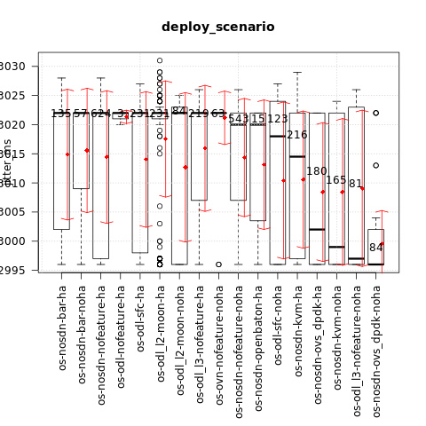
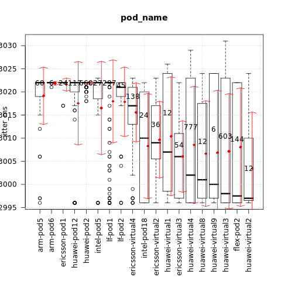
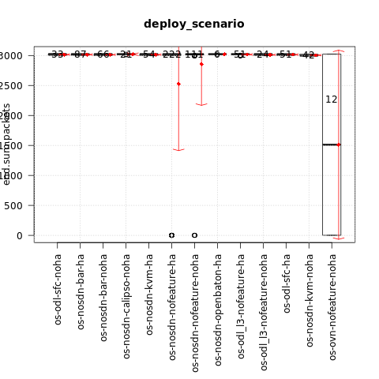
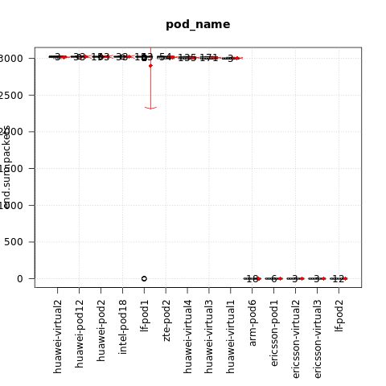

.. This work is licensed under a Creative Commons Attribution 4.0 International
.. License.
.. http://creativecommons.org/licenses/by/4.0

=============================================
Test results for TC011 packet delay variation
=============================================

.. toctree::
   :maxdepth: 2

Overview of test case
=====================

TC011 measures the packet delay variation sending the packets from one VM to the other.

Metric: packet delay variation (jitter)
Unit: ms

Euphrates release
-----------------

Test results per scenario and pod (lower is better):

{

    "os-nosdn-kvm-noha:huawei-virtual3:compass": [2996],

    "os-nosdn-nofeature-noha:huawei-virtual2:compass": [2996],

    "os-nosdn-ovs_dpdk-noha:huawei-virtual4:compass": [2996],

    "os-odl_l3-nofeature-noha:huawei-virtual4:compass": [2996],

    "os-nosdn-kvm-ha:huawei-virtual3:compass": [2997],

    "os-nosdn-nofeature-ha:huawei-virtual2:compass": [2997],

    "os-nosdn-ovs_dpdk-ha:huawei-virtual3:compass": [2997],

    "os-nosdn-ovs_dpdk-ha:huawei-virtual4:compass": [2997],

    "os-odl-sfc-ha:huawei-virtual4:compass": [2997],

    "os-nosdn-nofeature-ha:flex-pod2:apex": [2997.5],

    "os-nosdn-bar-ha:huawei-virtual3:compass": [2998],

    "os-odl-sfc-ha:huawei-virtual8:compass": [2998],

    "os-nosdn-nofeature-ha:intel-pod18:joid": [2999],

    "os-odl_l2-moon-ha:huawei-virtual4:compass": [2999.5],

    "os-nosdn-nofeature-ha:huawei-virtual9:compass": [3000],

    "os-nosdn-nofeature-noha:huawei-virtual1:compass": [3001],

    "os-nosdn-bar-ha:huawei-virtual4:compass": [3002],

    "os-nosdn-nofeature-ha:huawei-virtual4:compass": [3002],

    "os-nosdn-ovs_dpdk-noha:huawei-virtual3:compass": [3002],

    "os-odl-sfc-ha:huawei-virtual3:compass": [3002],

    "os-odl_l3-nofeature-ha:huawei-virtual4:compass": [3003],

    "os-nosdn-openbaton-ha:intel-pod18:joid": [3003.5],

    "os-nosdn-kvm-noha:huawei-virtual4:compass": [3004],

    "os-nosdn-kvm-noha:huawei-virtual8:compass": [3004],

    "os-nosdn-nofeature-ha:huawei-virtual3:compass": [3004.5],

    "os-odl_l3-nofeature-ha:huawei-virtual3:compass": [3005],

    "os-nosdn-nofeature-noha:ericsson-virtual3:fuel": [3006],

    "os-nosdn-kvm-ha:huawei-virtual4:compass": [3006.5],

    "os-nosdn-nofeature-noha:ericsson-virtual2:fuel": [3009],

    "os-nosdn-nofeature-noha:huawei-virtual3:compass": [3010],

    "os-odl_l3-nofeature-ha:huawei-virtual2:compass": [3010],

    "os-odl_l3-nofeature-noha:huawei-virtual3:compass": [3012],

    "os-nosdn-nofeature-ha:huawei-virtual1:compass": [3017],

    "os-nosdn-nofeature-noha:ericsson-virtual4:fuel": [3017],

    "os-odl-sfc-noha:huawei-virtual4:compass": [3017],

    "os-nosdn-nofeature-noha:intel-pod18:joid": [3018],

    "os-nosdn-nofeature-ha:intel-pod5:joid": [3020],

    "os-nosdn-nofeature-ha:lf-pod2:fuel": [3021],

    "os-nosdn-bar-ha:huawei-pod2:compass": [3022],

    "os-nosdn-bar-ha:lf-pod1:apex": [3022],

    "os-nosdn-bar-noha:lf-pod1:apex": [3022],

    "os-nosdn-kvm-ha:huawei-pod2:compass": [3022],

    "os-nosdn-nofeature-ha:arm-pod5:fuel": [3022],

    "os-nosdn-nofeature-ha:arm-pod6:fuel": [3022],

    "os-nosdn-nofeature-ha:ericsson-pod1:fuel": [3022],

    "os-nosdn-nofeature-ha:huawei-pod12:joid": [3022],

    "os-nosdn-nofeature-ha:huawei-pod2:compass": [3022],

    "os-nosdn-nofeature-ha:lf-pod1:apex": [3022],

    "os-nosdn-nofeature-noha:huawei-pod12:joid": [3022],

    "os-nosdn-nofeature-noha:intel-pod5:joid": [3022],

    "os-nosdn-nofeature-noha:lf-pod1:apex": [3022],

    "os-nosdn-openbaton-ha:huawei-pod12:joid": [3022],

    "os-nosdn-ovs_dpdk-ha:huawei-pod2:compass": [3022],

    "os-odl-nofeature-ha:arm-pod5:fuel": [3022],

    "os-odl-sfc-ha:huawei-pod2:compass": [3022],

    "os-odl-sfc-ha:lf-pod1:apex": [3022],

    "os-odl-sfc-noha:huawei-virtual3:compass": [3022],

    "os-odl-sfc-noha:lf-pod1:apex": [3022],

    "os-odl_l2-moon-ha:huawei-pod2:compass": [3022],

    "os-odl_l2-moon-ha:huawei-virtual3:compass": [3022],

    "os-odl_l2-moon-noha:huawei-virtual3:compass": [3022],

    "os-odl_l3-nofeature-ha:huawei-pod2:compass": [3022],

    "os-ovn-nofeature-noha:lf-pod1:apex": [3022],

    "os-nosdn-nofeature-noha:huawei-virtual4:compass": [3023],

    "os-odl_l2-moon-noha:huawei-virtual4:compass": [3023],

    "os-nosdn-nofeature-noha:huawei-virtual8:compass": [3024]

}

The influence of the scenario
^^^^^^^^^^^^^^^^^^^^^^^^^^^^^

{

    "os-nosdn-ovs_dpdk-noha": [2996],

    "os-odl_l3-nofeature-noha": [2997],

    "os-nosdn-kvm-noha": [2999],

    "os-nosdn-ovs_dpdk-ha": [3002],

    "os-nosdn-kvm-ha": [3014.5],

    "os-odl-sfc-noha": [3018],

    "os-nosdn-nofeature-noha": [3020],

    "os-nosdn-openbaton-ha": [3020],

    "os-nosdn-bar-ha": [3022],

    "os-nosdn-bar-noha": [3022],

    "os-nosdn-nofeature-ha": [3022],

    "os-odl-nofeature-ha": [3022],

    "os-odl-sfc-ha": [3022],

    "os-odl_l2-moon-ha": [3022],

    "os-odl_l2-moon-noha": [3022],

    "os-odl_l3-nofeature-ha": [3022],

    "os-ovn-nofeature-noha": [3022]

}

The influence of the POD
^^^^^^^^^^^^^^^^^^^^^^^^

{

    "huawei-virtual2": [2997],

    "flex-pod2": [2997.5],

    "huawei-virtual3": [2998],

    "huawei-virtual9": [3000],

    "huawei-virtual8": [3001],

    "huawei-virtual4": [3002],

    "ericsson-virtual3": [3006],

    "huawei-virtual1": [3007],

    "ericsson-virtual2": [3009],

    "intel-pod18": [3010],

    "ericsson-virtual4": [3017],

    "lf-pod2": [3021],

    "arm-pod5": [3022],

    "arm-pod6": [3022],

    "ericsson-pod1": [3022],

    "huawei-pod12": [3022],

    "huawei-pod2": [3022],

    "intel-pod5": [3022],

    "lf-pod1": [3022]

}

Fraser release
--------------

Test results per scenario and pod (lower is better):

{

    "os-nosdn-nofeature-ha:arm-pod6:fuel": [1],

    "os-nosdn-nofeature-ha:ericsson-pod1:fuel": [1],

    "os-nosdn-nofeature-ha:lf-pod2:fuel": [1],

    "os-nosdn-nofeature-noha:ericsson-virtual2:fuel": [1],

    "os-nosdn-nofeature-noha:ericsson-virtual3:fuel": [1],

    "os-ovn-nofeature-noha:lf-pod1:apex": [1511.5],

    "os-nosdn-kvm-noha:huawei-virtual3:compass": [2996],

    "os-nosdn-bar-ha:huawei-virtual4:compass": [2997],

    "os-nosdn-bar-noha:huawei-virtual4:compass": [2997],

    "os-nosdn-kvm-ha:huawei-virtual4:compass": [2997],

    "os-nosdn-nofeature-ha:huawei-virtual1:compass": [2997],

    "os-nosdn-nofeature-ha:huawei-virtual3:compass": [2997],

    "os-nosdn-nofeature-ha:huawei-virtual4:compass": [2997],

    "os-odl-sfc-ha:huawei-virtual3:compass": [2997],

    "os-odl_l3-nofeature-ha:huawei-virtual3:compass": [2997],

    "os-odl_l3-nofeature-noha:huawei-virtual3:compass": [3000],

    "os-odl_l3-nofeature-ha:huawei-virtual4:compass": [3003],

    "os-nosdn-bar-noha:huawei-virtual3:compass": [3011],

    "os-nosdn-bar-ha:huawei-virtual3:compass": [3015.5],

    "os-nosdn-kvm-noha:huawei-virtual4:compass": [3019],

    "os-nosdn-nofeature-noha:huawei-virtual4:compass": [3021],

    "os-odl-sfc-ha:huawei-virtual4:compass": [3021],

    "os-nosdn-bar-ha:huawei-pod2:compass": [3022],

    "os-nosdn-bar-ha:lf-pod1:apex": [3022],

    "os-nosdn-bar-noha:lf-pod1:apex": [3022],

    "os-nosdn-calipso-noha:lf-pod1:apex": [3022],

    "os-nosdn-kvm-ha:huawei-pod2:compass": [3022],

    "os-nosdn-nofeature-ha:huawei-pod12:joid": [3022],

    "os-nosdn-nofeature-ha:huawei-pod2:compass": [3022],

    "os-nosdn-nofeature-ha:intel-pod18:joid": [3022],

    "os-nosdn-nofeature-ha:lf-pod1:apex": [3022],

    "os-nosdn-nofeature-ha:zte-pod2:daisy": [3022],

    "os-nosdn-nofeature-noha:huawei-pod12:joid": [3022],

    "os-nosdn-nofeature-noha:intel-pod18:joid": [3022],

    "os-nosdn-nofeature-noha:lf-pod1:apex": [3022],

    "os-nosdn-openbaton-ha:intel-pod18:joid": [3022],

    "os-odl-sfc-ha:huawei-pod2:compass": [3022],

    "os-odl_l3-nofeature-ha:huawei-pod2:compass": [3022],

    "os-odl_l3-nofeature-noha:huawei-virtual4:compass": [3022],

    "os-odl-sfc-noha:huawei-virtual4:compass": [3022.5],

    "os-nosdn-nofeature-noha:huawei-virtual3:compass": [3023],

    "os-odl-sfc-noha:huawei-virtual3:compass": [3023],

    "os-nosdn-nofeature-noha:huawei-virtual2:compass": [3025]

}

The influence of the scenario
^^^^^^^^^^^^^^^^^^^^^^^^^^^^^

{

    "os-ovn-nofeature-noha": [1511.5],

    "os-nosdn-kvm-noha": [2997],

    "os-odl-sfc-ha": [3021],

    "os-nosdn-bar-ha": [3022],

    "os-nosdn-bar-noha": [3022],

    "os-nosdn-calipso-noha": [3022],

    "os-nosdn-kvm-ha": [3022],

    "os-nosdn-nofeature-ha": [3022],

    "os-nosdn-nofeature-noha": [3022],

    "os-nosdn-openbaton-ha": [3022],

    "os-odl_l3-nofeature-ha": [3022],

    "os-odl_l3-nofeature-noha": [3022],

    "os-odl-sfc-noha": [3023]

}

The influence of the POD
^^^^^^^^^^^^^^^^^^^^^^^^

{

    "arm-pod6": [1],

    "ericsson-pod1": [1],

    "ericsson-virtual2": [1],

    "ericsson-virtual3": [1],

    "lf-pod2": [1],

    "huawei-virtual1": [2997],

    "huawei-virtual3": [2999],

    "huawei-virtual4": [3002],

    "huawei-pod12": [3022],

    "huawei-pod2": [3022],

    "intel-pod18": [3022],

    "lf-pod1": [3022],

    "zte-pod2": [3022],

    "huawei-virtual2": [3025]

}
