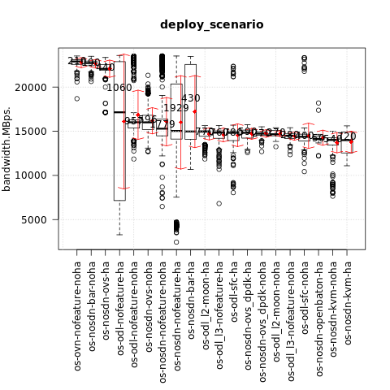
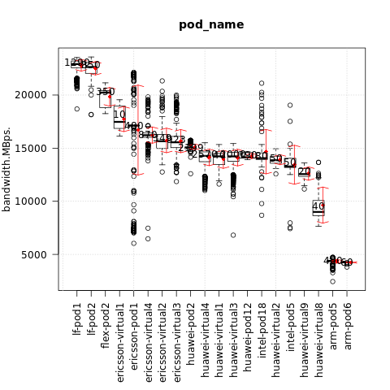
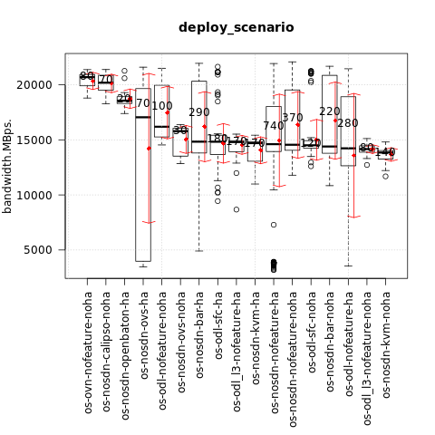
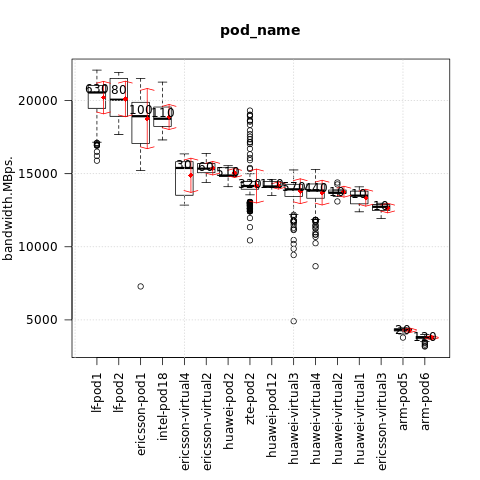

.. This work is licensed under a Creative Commons Attribution 4.0 International
.. License.
.. http://creativecommons.org/licenses/by/4.0

==================================================
Test results for TC012 memory read/write bandwidth
==================================================

.. toctree::
   :maxdepth: 2

Overview of test case
=====================

TC012 measures the rate at which data can be read from and written to the memory (this includes all levels of memory).
In this test case,  the bandwidth to read data from memory and then write data to the same memory location are measured.

Metric: memory bandwidth
Unit: MBps

Euphrates release
-----------------

Test results per scenario and pod (higher is better):

{

    "os-nosdn-nofeature-ha:lf-pod1:apex": [23126.325],

    "os-odl-nofeature-noha:lf-pod1:apex": [23123.975],

    "os-odl-nofeature-ha:lf-pod1:apex": [23068.965],

    "os-odl-nofeature-ha:lf-pod2:fuel": [22972.46],

    "os-nosdn-nofeature-ha:lf-pod2:fuel": [22912.015],

    "os-nosdn-nofeature-noha:lf-pod1:apex": [22911.35],

    "os-ovn-nofeature-noha:lf-pod1:apex": [22900.93],

    "os-nosdn-bar-ha:lf-pod1:apex": [22767.56],

    "os-nosdn-bar-noha:lf-pod1:apex": [22721.83],

    "os-odl-sfc-noha:lf-pod1:apex": [22511.565],

    "os-nosdn-ovs-ha:lf-pod2:fuel": [22071.235],

    "os-odl-sfc-ha:lf-pod1:apex": [21646.415],

    "os-nosdn-nofeature-ha:flex-pod2:apex": [20229.99],

    "os-nosdn-ovs-noha:ericsson-virtual4:fuel": [17491.18],

    "os-nosdn-ovs-noha:ericsson-virtual1:fuel": [17474.965],

    "os-nosdn-ovs-ha:ericsson-pod1:fuel": [17141.375],

    "os-nosdn-nofeature-ha:ericsson-pod1:fuel": [17134.99],

    "os-odl-nofeature-ha:ericsson-pod1:fuel": [17124.27],

    "os-nosdn-ovs-noha:ericsson-virtual2:fuel": [16599.325],

    "os-nosdn-nofeature-noha:ericsson-virtual4:fuel": [16309.13],

    "os-odl-nofeature-noha:ericsson-virtual4:fuel": [16137.48],

    "os-nosdn-nofeature-noha:ericsson-virtual2:fuel": [15960.76],

    "os-nosdn-ovs-noha:ericsson-virtual3:fuel": [15685.505],

    "os-nosdn-nofeature-noha:ericsson-virtual3:fuel": [15536.65],

    "os-odl-nofeature-noha:ericsson-virtual3:fuel": [15431.795],

    "os-odl-nofeature-noha:ericsson-virtual2:fuel": [15129.27],

    "os-nosdn-ovs_dpdk-ha:huawei-pod2:compass": [15125.51],

    "os-odl_l3-nofeature-ha:huawei-pod2:compass": [15030.65],

    "os-nosdn-nofeature-ha:huawei-pod2:compass": [15019.89],

    "os-odl-sfc-ha:huawei-pod2:compass": [15005.11],

    "os-nosdn-bar-ha:huawei-pod2:compass": [14975.645],

    "os-nosdn-kvm-ha:huawei-pod2:compass": [14968.97],

    "os-odl_l2-moon-ha:huawei-pod2:compass": [14968.97],

    "os-nosdn-ovs_dpdk-noha:huawei-virtual4:compass": [14741.425],

    "os-nosdn-ovs_dpdk-noha:huawei-virtual3:compass": [14714.28],

    "os-odl_l2-moon-noha:huawei-virtual4:compass": [14674.38],

    "os-odl_l2-moon-noha:huawei-virtual3:compass": [14664.12],

    "os-odl-sfc-noha:huawei-virtual4:compass": [14587.62],

    "os-nosdn-nofeature-noha:huawei-virtual3:compass": [14539.94],

    "os-nosdn-nofeature-noha:huawei-virtual4:compass": [14534.54],

    "os-odl_l3-nofeature-noha:huawei-virtual3:compass": [14511.925],

    "os-nosdn-nofeature-noha:huawei-virtual1:compass": [14496.875],

    "os-odl_l2-moon-ha:huawei-virtual3:compass": [14378.87],

    "os-odl_l3-nofeature-noha:huawei-virtual4:compass": [14366.69],

    "os-nosdn-nofeature-ha:huawei-virtual4:compass": [14356.695],

    "os-odl_l3-nofeature-ha:huawei-virtual3:compass": [14341.605],

    "os-nosdn-ovs_dpdk-ha:huawei-virtual3:compass": [14327.78],

    "os-nosdn-ovs_dpdk-ha:huawei-virtual4:compass": [14313.81],

    "os-nosdn-nofeature-ha:intel-pod18:joid": [14284.365],

    "os-nosdn-nofeature-noha:huawei-pod12:joid": [14157.99],

    "os-nosdn-nofeature-ha:huawei-pod12:joid": [14144.86],

    "os-nosdn-openbaton-ha:huawei-pod12:joid": [14138.9],

    "os-nosdn-kvm-noha:huawei-virtual3:compass": [14117.7],

    "os-nosdn-nofeature-ha:huawei-virtual3:compass": [14097.255],

    "os-nosdn-nofeature-noha:huawei-virtual2:compass": [14085.675],

    "os-odl-sfc-noha:huawei-virtual3:compass": [14071.605],

    "os-nosdn-openbaton-ha:intel-pod18:joid": [14059.51],

    "os-odl-sfc-ha:huawei-virtual4:compass": [14057.155],

    "os-odl-sfc-ha:huawei-virtual3:compass": [14051.945],

    "os-nosdn-bar-ha:huawei-virtual3:compass": [14020.74],

    "os-nosdn-kvm-noha:huawei-virtual4:compass": [14017.915],

    "os-nosdn-nofeature-noha:intel-pod18:joid": [13954.27],

    "os-odl_l3-nofeature-ha:huawei-virtual4:compass": [13915.87],

    "os-odl_l3-nofeature-ha:huawei-virtual2:compass": [13874.59],

    "os-nosdn-nofeature-noha:intel-pod5:joid": [13812.215],

    "os-odl_l2-moon-ha:huawei-virtual4:compass": [13777.59],

    "os-nosdn-bar-ha:huawei-virtual4:compass": [13765.36],

    "os-nosdn-nofeature-ha:huawei-virtual1:compass": [13559.905],

    "os-nosdn-nofeature-ha:huawei-virtual2:compass": [13477.52],

    "os-nosdn-kvm-ha:huawei-virtual3:compass": [13255.17],

    "os-nosdn-nofeature-ha:intel-pod5:joid": [13189.64],

    "os-nosdn-kvm-ha:huawei-virtual4:compass": [12718.545],

    "os-nosdn-nofeature-ha:huawei-virtual9:compass": [12559.445],

    "os-nosdn-nofeature-noha:huawei-virtual8:compass": [12409.66],

    "os-nosdn-kvm-noha:huawei-virtual8:compass": [8832.515],

    "os-odl-sfc-ha:huawei-virtual8:compass": [8823.955],

    "os-odl-nofeature-ha:arm-pod5:fuel": [4398.08],

    "os-nosdn-nofeature-ha:arm-pod5:fuel": [4375.75],

    "os-nosdn-nofeature-ha:arm-pod6:fuel": [4260.77],

    "os-odl-nofeature-ha:arm-pod6:fuel": [4259.62]

}

The influence of the scenario
^^^^^^^^^^^^^^^^^^^^^^^^^^^^^

{

    "os-ovn-nofeature-noha": [22900.93],

    "os-nosdn-bar-noha": [22721.83],

    "os-nosdn-ovs-ha": [22063.67],

    "os-odl-nofeature-ha": [17146.05],

    "os-odl-nofeature-noha": [16017.41],

    "os-nosdn-ovs-noha": [16005.74],

    "os-nosdn-nofeature-noha": [15290.94],

    "os-nosdn-nofeature-ha": [15038.74],

    "os-nosdn-bar-ha": [14972.975],

    "os-odl_l2-moon-ha": [14956.955],

    "os-odl_l3-nofeature-ha": [14839.21],

    "os-odl-sfc-ha": [14823.48],

    "os-nosdn-ovs_dpdk-ha": [14822.17],

    "os-nosdn-ovs_dpdk-noha": [14725.9],

    "os-odl_l2-moon-noha": [14665.4],

    "os-odl_l3-nofeature-noha": [14483.09],

    "os-odl-sfc-noha": [14373.21],

    "os-nosdn-openbaton-ha": [14135.325],

    "os-nosdn-kvm-noha": [14020.26],

    "os-nosdn-kvm-ha": [13996.02]

}

The influence of the POD
^^^^^^^^^^^^^^^^^^^^^^^^

{

    "lf-pod1": [22912.39],

    "lf-pod2": [22637.67],

    "flex-pod2": [20229.99],

    "ericsson-virtual1": [17474.965],

    "ericsson-pod1": [17127.38],

    "ericsson-virtual4": [16219.97],

    "ericsson-virtual2": [15652.28],

    "ericsson-virtual3": [15551.26],

    "huawei-pod2": [15017.2],

    "huawei-virtual4": [14266.34],

    "huawei-virtual1": [14233.035],

    "huawei-virtual3": [14227.63],

    "huawei-pod12": [14147.245],

    "intel-pod18": [14058.33],

    "huawei-virtual2": [13862.85],

    "intel-pod5": [13280.32],

    "huawei-virtual9": [12559.445],

    "huawei-virtual8": [8998.02],

    "arm-pod5": [4388.875],

    "arm-pod6": [4260.2]

}

Fraser release
--------------

Test results per scenario and pod (higher is better):

{

    "os-nosdn-nofeature-ha:lf-pod2:fuel": [21421.795],

    "os-odl-sfc-noha:lf-pod1:apex": [21075],

    "os-odl-sfc-ha:lf-pod1:apex": [21017.44],

    "os-nosdn-bar-noha:lf-pod1:apex": [20991.46],

    "os-nosdn-bar-ha:lf-pod1:apex": [20812.405],

    "os-ovn-nofeature-noha:lf-pod1:apex": [20694.035],

    "os-nosdn-nofeature-noha:lf-pod1:apex": [20672.765],

    "os-odl-nofeature-ha:lf-pod2:fuel": [20269.65],

    "os-nosdn-calipso-noha:lf-pod1:apex": [20186.32],

    "os-odl-nofeature-noha:lf-pod1:apex": [19959.915],

    "os-nosdn-ovs-ha:lf-pod2:fuel": [19719.38],

    "os-odl-nofeature-ha:lf-pod1:apex": [19654.505],

    "os-nosdn-nofeature-ha:lf-pod1:apex": [19391.145],

    "os-nosdn-nofeature-noha:intel-pod18:joid": [19378.64],

    "os-odl-nofeature-ha:ericsson-pod1:fuel": [19103.43],

    "os-nosdn-nofeature-ha:intel-pod18:joid": [18688.695],

    "os-nosdn-openbaton-ha:intel-pod18:joid": [18557.95],

    "os-nosdn-nofeature-ha:ericsson-pod1:fuel": [17088.61],

    "os-nosdn-ovs-ha:ericsson-pod1:fuel": [17040.78],

    "os-nosdn-ovs-noha:ericsson-virtual2:fuel": [16057.235],

    "os-odl-nofeature-noha:ericsson-virtual4:fuel": [15622.355],

    "os-nosdn-nofeature-noha:ericsson-virtual2:fuel": [15422.235],

    "os-odl-sfc-ha:huawei-pod2:compass": [15403.09],

    "os-odl-nofeature-noha:ericsson-virtual2:fuel": [15141.58],

    "os-nosdn-bar-ha:huawei-pod2:compass": [14922.37],

    "os-odl_l3-nofeature-ha:huawei-pod2:compass": [14864.195],

    "os-nosdn-nofeature-ha:huawei-pod2:compass": [14856.295],

    "os-nosdn-kvm-ha:huawei-pod2:compass": [14796.035],

    "os-odl-sfc-noha:huawei-virtual4:compass": [14484.375],

    "os-nosdn-nofeature-ha:huawei-pod12:joid": [14441.955],

    "os-odl-sfc-noha:huawei-virtual3:compass": [14373],

    "os-nosdn-nofeature-noha:huawei-virtual4:compass": [14330.44],

    "os-nosdn-ovs-noha:ericsson-virtual4:fuel": [14320.305],

    "os-odl_l3-nofeature-noha:huawei-virtual3:compass": [14253.715],

    "os-nosdn-nofeature-ha:huawei-virtual4:compass": [14203.655],

    "os-nosdn-nofeature-noha:huawei-virtual3:compass": [14179.93],

    "os-odl-nofeature-ha:zte-pod2:daisy": [14177.135],

    "os-nosdn-nofeature-ha:zte-pod2:daisy": [14150.825],

    "os-nosdn-nofeature-noha:huawei-pod12:joid": [14100.87],

    "os-nosdn-bar-noha:huawei-virtual4:compass": [14033.36],

    "os-odl_l3-nofeature-noha:huawei-virtual4:compass": [13963.73],

    "os-nosdn-kvm-noha:huawei-virtual3:compass": [13874.775],

    "os-nosdn-kvm-noha:huawei-virtual4:compass": [13805.65],

    "os-odl_l3-nofeature-ha:huawei-virtual3:compass": [13754.63],

    "os-nosdn-nofeature-noha:huawei-virtual2:compass": [13702.92],

    "os-nosdn-bar-ha:huawei-virtual3:compass": [13638.115],

    "os-odl-sfc-ha:huawei-virtual3:compass": [13637.83],

    "os-odl_l3-nofeature-ha:huawei-virtual4:compass": [13635.66],

    "os-nosdn-bar-noha:huawei-virtual3:compass": [13635.58],

    "os-nosdn-bar-ha:huawei-virtual4:compass": [13544.95],

    "os-nosdn-nofeature-ha:huawei-virtual3:compass": [13514.27],

    "os-nosdn-nofeature-ha:huawei-virtual1:compass": [13496.45],

    "os-odl-sfc-ha:huawei-virtual4:compass": [13475.38],

    "os-nosdn-nofeature-noha:ericsson-virtual3:fuel": [12733.19],

    "os-nosdn-kvm-ha:huawei-virtual4:compass": [12682.805],

    "os-odl-nofeature-ha:arm-pod5:fuel": [4326.11],

    "os-nosdn-nofeature-ha:arm-pod6:fuel": [3824.13],

    "os-odl-nofeature-ha:arm-pod6:fuel": [3797.795],

    "os-nosdn-ovs-ha:arm-pod6:fuel": [3749.91]

}

The influence of the scenario
^^^^^^^^^^^^^^^^^^^^^^^^^^^^^

{

    "os-ovn-nofeature-noha": [20694.035],

    "os-nosdn-calipso-noha": [20186.32],

    "os-nosdn-openbaton-ha": [18557.95],

    "os-nosdn-ovs-ha": [17048.17],

    "os-odl-nofeature-noha": [16191.125],

    "os-nosdn-ovs-noha": [15790.32],

    "os-nosdn-bar-ha": [14833.97],

    "os-odl-sfc-ha": [14828.72],

    "os-odl_l3-nofeature-ha": [14801.25],

    "os-nosdn-kvm-ha": [14700.1],

    "os-nosdn-nofeature-ha": [14610.48],

    "os-nosdn-nofeature-noha": [14555.975],

    "os-odl-sfc-noha": [14508.14],

    "os-nosdn-bar-noha": [14395.22],

    "os-odl-nofeature-ha": [14231.245],

    "os-odl_l3-nofeature-noha": [14161.58],

    "os-nosdn-kvm-noha": [13845.685]

}

The influence of the POD
^^^^^^^^^^^^^^^^^^^^^^^^

{

    "lf-pod1": [20552.9],

    "lf-pod2": [20058.925],

    "ericsson-pod1": [18930.78],

    "intel-pod18": [18757.545],

    "ericsson-virtual4": [15389.465],

    "ericsson-virtual2": [15343.79],

    "huawei-pod2": [14870.78],

    "zte-pod2": [14157.99],

    "huawei-pod12": [14126.99],

    "huawei-virtual3": [13929.67],

    "huawei-virtual4": [13847.155],

    "huawei-virtual2": [13702.92],

    "huawei-virtual1": [13496.45],

    "ericsson-virtual3": [12733.19],

    "arm-pod5": [4326.11],

    "arm-pod6": [3809.885]

}
