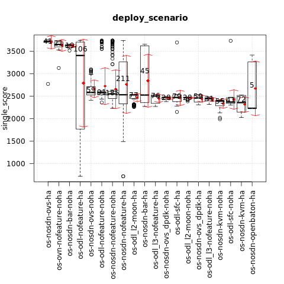
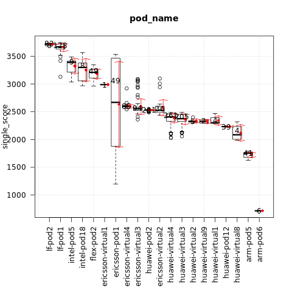
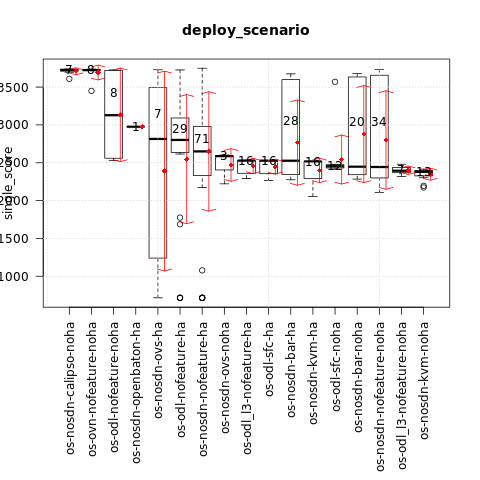
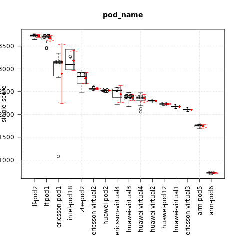

.. This work is licensed under a Creative Commons Attribution 4.0 International
.. License.
.. http://creativecommons.org/licenses/by/4.0

===========================================
Test results for TC014 cpu processing speed
===========================================

.. toctree::
   :maxdepth: 2

Overview of test case
=====================

TC014 measures score of single cpu running using UnixBench.

Metric: score of single CPU running
Unit: N/A

Euphrates release
-----------------

Test results per scenario and pod (higher is better):

{

    "os-odl-sfc-noha:lf-pod1:apex": [3735.2],

    "os-nosdn-ovs-ha:lf-pod2:fuel": [3725.5],

    "os-odl-nofeature-ha:lf-pod2:fuel": [3711],

    "os-odl-nofeature-ha:lf-pod1:apex": [3708.4],

    "os-nosdn-nofeature-noha:lf-pod1:apex": [3705.7],

    "os-nosdn-nofeature-ha:lf-pod2:fuel": [3704],

    "os-nosdn-nofeature-ha:lf-pod1:apex": [3703.2],

    "os-odl-nofeature-noha:lf-pod1:apex": [3702.8],

    "os-odl-sfc-ha:lf-pod1:apex": [3698.7],

    "os-ovn-nofeature-noha:lf-pod1:apex": [3654.8],

    "os-nosdn-bar-ha:lf-pod1:apex": [3635.55],

    "os-nosdn-bar-noha:lf-pod1:apex": [3633.2],

    "os-nosdn-nofeature-noha:intel-pod18:joid": [3450.3],

    "os-nosdn-nofeature-noha:intel-pod5:joid": [3406.4],

    "os-nosdn-nofeature-ha:intel-pod5:joid": [3360.4],

    "os-nosdn-openbaton-ha:intel-pod18:joid": [3340.65],

    "os-nosdn-nofeature-ha:flex-pod2:apex": [3208.6],

    "os-nosdn-nofeature-ha:ericsson-pod1:fuel": [3134.8],

    "os-nosdn-nofeature-ha:intel-pod18:joid": [3056.2],

    "os-nosdn-ovs-noha:ericsson-virtual1:fuel": [2988.9],

    "os-nosdn-ovs-ha:ericsson-pod1:fuel": [2773.7],

    "os-nosdn-ovs-noha:ericsson-virtual4:fuel": [2645.85],

    "os-nosdn-ovs-noha:ericsson-virtual2:fuel": [2625.3],

    "os-nosdn-nofeature-noha:ericsson-virtual4:fuel": [2601.3],

    "os-odl-nofeature-noha:ericsson-virtual4:fuel": [2590.4],

    "os-nosdn-nofeature-noha:ericsson-virtual2:fuel": [2570.2],

    "os-nosdn-ovs-noha:ericsson-virtual3:fuel": [2558.8],

    "os-odl-nofeature-ha:ericsson-pod1:fuel": [2556.5],

    "os-nosdn-nofeature-noha:ericsson-virtual3:fuel": [2554.6],

    "os-odl-nofeature-noha:ericsson-virtual3:fuel": [2536.75],

    "os-nosdn-ovs_dpdk-ha:huawei-pod2:compass": [2533.55],

    "os-nosdn-nofeature-ha:huawei-pod2:compass": [2531.85],

    "os-odl-sfc-ha:huawei-pod2:compass": [2531.7],

    "os-odl_l3-nofeature-ha:huawei-pod2:compass": [2531.2],

    "os-odl_l2-moon-ha:huawei-pod2:compass": [2531],

    "os-nosdn-bar-ha:huawei-pod2:compass": [2529.6],

    "os-nosdn-kvm-ha:huawei-pod2:compass": [2520.5],

    "os-odl-nofeature-noha:ericsson-virtual2:fuel": [2481.15],

    "os-nosdn-ovs_dpdk-noha:huawei-virtual4:compass": [2474],

    "os-nosdn-ovs_dpdk-noha:huawei-virtual3:compass": [2472.6],

    "os-odl_l2-moon-noha:huawei-virtual4:compass": [2471],

    "os-odl_l2-moon-noha:huawei-virtual3:compass": [2470.6],

    "os-nosdn-nofeature-noha:huawei-virtual3:compass": [2464.15],

    "os-odl-sfc-noha:huawei-virtual4:compass": [2455.9],

    "os-nosdn-nofeature-noha:huawei-virtual4:compass": [2455.3],

    "os-odl_l3-nofeature-noha:huawei-virtual3:compass": [2446.85],

    "os-odl_l2-moon-ha:huawei-virtual3:compass": [2444.75],

    "os-odl_l3-nofeature-noha:huawei-virtual4:compass": [2430.9],

    "os-nosdn-nofeature-ha:huawei-virtual4:compass": [2421.3],

    "os-nosdn-ovs_dpdk-ha:huawei-virtual4:compass": [2415.7],

    "os-nosdn-kvm-noha:huawei-virtual3:compass": [2399.4],

    "os-odl-sfc-ha:huawei-virtual3:compass": [2391.85],

    "os-nosdn-kvm-noha:huawei-virtual4:compass": [2391.45],

    "os-nosdn-nofeature-noha:huawei-virtual1:compass": [2380.7],

    "os-odl-sfc-ha:huawei-virtual4:compass": [2379.6],

    "os-nosdn-ovs_dpdk-ha:huawei-virtual3:compass": [2371.9],

    "os-odl-sfc-noha:huawei-virtual3:compass": [2364.6],

    "os-nosdn-bar-ha:huawei-virtual3:compass": [2363.4],

    "os-nosdn-nofeature-ha:huawei-virtual3:compass": [2362],

    "os-nosdn-kvm-ha:huawei-virtual4:compass": [2358.5],

    "os-odl_l3-nofeature-ha:huawei-virtual3:compass": [2358.45],

    "os-odl_l3-nofeature-ha:huawei-virtual2:compass": [2336],

    "os-odl_l3-nofeature-ha:huawei-virtual4:compass": [2326.6],

    "os-nosdn-nofeature-ha:huawei-virtual9:compass": [2324.95],

    "os-nosdn-nofeature-noha:huawei-virtual8:compass": [2320.2],

    "os-nosdn-bar-ha:huawei-virtual4:compass": [2318.5],

    "os-odl_l2-moon-ha:huawei-virtual4:compass": [2312.8],

    "os-nosdn-nofeature-noha:huawei-virtual2:compass": [2311.7],

    "os-nosdn-nofeature-ha:huawei-virtual1:compass": [2301.15],

    "os-nosdn-nofeature-ha:huawei-virtual2:compass": [2297.7],

    "os-nosdn-nofeature-noha:huawei-pod12:joid": [2232.8],

    "os-nosdn-nofeature-ha:huawei-pod12:joid": [2232.1],

    "os-nosdn-openbaton-ha:huawei-pod12:joid": [2230],

    "os-nosdn-kvm-ha:huawei-virtual3:compass": [2154],

    "os-odl-sfc-ha:huawei-virtual8:compass": [2150.1],

    "os-nosdn-kvm-noha:huawei-virtual8:compass": [2004.3],

    "os-odl-nofeature-ha:arm-pod5:fuel": [1754.5],

    "os-nosdn-nofeature-ha:arm-pod5:fuel": [1754.15],

    "os-odl-nofeature-ha:arm-pod6:fuel": [716.15],

    "os-nosdn-nofeature-ha:arm-pod6:fuel": [716.05]

}

The influence of the scenario
^^^^^^^^^^^^^^^^^^^^^^^^^^^^^

{

    "os-nosdn-ovs-ha": [3725.5],

    "os-ovn-nofeature-noha": [3654.8],

    "os-nosdn-bar-noha": [3633.2],

    "os-odl-nofeature-ha": [3407.8],

    "os-nosdn-ovs-noha": [2583.2],

    "os-odl-nofeature-noha": [2578.9],

    "os-nosdn-nofeature-noha": [2553.2],

    "os-nosdn-nofeature-ha": [2532.8],

    "os-odl_l2-moon-ha": [2530.5],

    "os-nosdn-bar-ha": [2527],

    "os-odl_l3-nofeature-ha": [2501.5],

    "os-nosdn-ovs_dpdk-noha": [2473.65],

    "os-odl-sfc-ha": [2472.9],

    "os-odl_l2-moon-noha": [2470.8],

    "os-nosdn-ovs_dpdk-ha": [2461.9],

    "os-odl_l3-nofeature-noha": [2442.8],

    "os-nosdn-kvm-noha": [2392.9],

    "os-odl-sfc-noha": [2370.5],

    "os-nosdn-kvm-ha": [2358.5],

    "os-nosdn-openbaton-ha": [2231.8]

}

The influence of the POD
^^^^^^^^^^^^^^^^^^^^^^^^

{

    "lf-pod2": [3723.95],

    "lf-pod1": [3669],

    "intel-pod5": [3388.6],

    "intel-pod18": [3298.4],

    "flex-pod2": [3208.6],

    "ericsson-virtual1": [2988.9],

    "ericsson-pod1": [2669.1],

    "ericsson-virtual4": [2598.5],

    "ericsson-virtual3": [2553.15],

    "huawei-pod2": [2531.2],

    "ericsson-virtual2": [2526.9],

    "huawei-virtual4": [2407.4],

    "huawei-virtual3": [2374.6],

    "huawei-virtual2": [2326.4],

    "huawei-virtual9": [2324.95],

    "huawei-virtual1": [2302.6],

    "huawei-pod12": [2232.2],

    "huawei-virtual8": [2085.3],

    "arm-pod5": [1754.4],

    "arm-pod6": [716.15]

}

Fraser release
--------------

Test results per scenario and pod (higher is better):

{

    "os-nosdn-nofeature-ha:lf-pod2:fuel": [3747.3],

    "os-nosdn-calipso-noha:lf-pod1:apex": [3727.2],

    "os-odl-nofeature-ha:lf-pod1:apex": [3726.5],

    "os-ovn-nofeature-noha:lf-pod1:apex": [3723.8],

    "os-odl-nofeature-noha:lf-pod1:apex": [3718.9],

    "os-nosdn-nofeature-noha:lf-pod1:apex": [3717.75],

    "os-nosdn-nofeature-ha:lf-pod1:apex": [3706.5],

    "os-odl-nofeature-ha:lf-pod2:fuel": [3704.9],

    "os-nosdn-ovs-ha:lf-pod2:fuel": [3687.7],

    "os-nosdn-bar-noha:lf-pod1:apex": [3635.4],

    "os-nosdn-bar-ha:lf-pod1:apex": [3632.55],

    "os-odl-sfc-noha:lf-pod1:apex": [3569],

    "os-nosdn-nofeature-noha:intel-pod18:joid": [3432.1],

    "os-odl-nofeature-ha:ericsson-pod1:fuel": [3133.85],

    "os-nosdn-ovs-ha:ericsson-pod1:fuel": [3079.8],

    "os-nosdn-nofeature-ha:intel-pod18:joid": [3074.75],

    "os-nosdn-openbaton-ha:intel-pod18:joid": [2976.2],

    "os-nosdn-nofeature-ha:zte-pod2:daisy": [2910.95],

    "os-odl-nofeature-ha:zte-pod2:daisy": [2801.1],

    "os-nosdn-ovs-noha:ericsson-virtual2:fuel": [2603],

    "os-odl-nofeature-noha:ericsson-virtual2:fuel": [2559.7],

    "os-nosdn-nofeature-noha:ericsson-virtual2:fuel": [2539.1],

    "os-odl_l3-nofeature-ha:huawei-pod2:compass": [2530.5],

    "os-nosdn-nofeature-ha:huawei-pod2:compass": [2529.4],

    "os-odl-sfc-ha:huawei-pod2:compass": [2528.9],

    "os-odl-nofeature-noha:ericsson-virtual4:fuel": [2527.8],

    "os-nosdn-bar-ha:huawei-pod2:compass": [2527.4],

    "os-nosdn-kvm-ha:huawei-pod2:compass": [2517.8],

    "os-nosdn-nofeature-noha:huawei-virtual4:compass": [2472.4],

    "os-nosdn-nofeature-ha:huawei-virtual4:compass": [2469.1],

    "os-odl-sfc-noha:huawei-virtual3:compass": [2452.05],

    "os-odl-sfc-noha:huawei-virtual4:compass": [2438.7],

    "os-odl_l3-nofeature-noha:huawei-virtual3:compass": [2418.4],

    "os-nosdn-ovs-noha:ericsson-virtual4:fuel": [2404.35],

    "os-nosdn-kvm-noha:huawei-virtual3:compass": [2391],

    "os-nosdn-kvm-noha:huawei-virtual4:compass": [2376.75],

    "os-odl_l3-nofeature-noha:huawei-virtual4:compass": [2376.2],

    "os-nosdn-nofeature-noha:huawei-virtual3:compass": [2359.45],

    "os-nosdn-bar-noha:huawei-virtual4:compass": [2353.3],

    "os-odl-sfc-ha:huawei-virtual3:compass": [2351.9],

    "os-nosdn-bar-ha:huawei-virtual3:compass": [2339.4],

    "os-odl-sfc-ha:huawei-virtual4:compass": [2335.6],

    "os-nosdn-bar-ha:huawei-virtual4:compass": [2328],

    "os-odl_l3-nofeature-ha:huawei-virtual3:compass": [2324.5],

    "os-nosdn-bar-noha:huawei-virtual3:compass": [2317.3],

    "os-nosdn-nofeature-ha:huawei-virtual3:compass": [2313.95],

    "os-odl_l3-nofeature-ha:huawei-virtual4:compass": [2308.1],

    "os-nosdn-nofeature-noha:huawei-virtual2:compass": [2299.3],

    "os-nosdn-kvm-ha:huawei-virtual4:compass": [2250.4],

    "os-nosdn-nofeature-noha:huawei-pod12:joid": [2229.7],

    "os-nosdn-nofeature-ha:huawei-pod12:joid": [2228.8],

    "os-nosdn-nofeature-ha:huawei-virtual1:compass": [2171.3],

    "os-nosdn-nofeature-noha:ericsson-virtual3:fuel": [2104.8],

    "os-nosdn-nofeature-ha:ericsson-pod1:fuel": [1961.35],

    "os-nosdn-ovs-ha:arm-pod5:fuel": [1764.2],

    "os-odl-nofeature-ha:arm-pod5:fuel": [1730.95],

    "os-nosdn-ovs-ha:arm-pod6:fuel": [715.55],

    "os-odl-nofeature-ha:arm-pod6:fuel": [715.4],

    "os-nosdn-nofeature-ha:arm-pod6:fuel": [715.25]

}

The influence of the scenario
^^^^^^^^^^^^^^^^^^^^^^^^^^^^^

{

    "os-nosdn-calipso-noha": [3727.2],

    "os-ovn-nofeature-noha": [3723.8],

    "os-odl-nofeature-noha": [3128.05],

    "os-nosdn-openbaton-ha": [2976.2],

    "os-nosdn-ovs-ha": [2814.5],

    "os-odl-nofeature-ha": [2801.4],

    "os-nosdn-nofeature-ha": [2649.7],

    "os-nosdn-ovs-noha": [2587.3],

    "os-odl_l3-nofeature-ha": [2528.45],

    "os-odl-sfc-ha": [2527.6],

    "os-nosdn-bar-ha": [2526.55],

    "os-nosdn-kvm-ha": [2516.95],

    "os-odl-sfc-noha": [2453.65],

    "os-nosdn-bar-noha": [2447.7],

    "os-nosdn-nofeature-noha": [2443.85],

    "os-odl_l3-nofeature-noha": [2394.3],

    "os-nosdn-kvm-noha": [2379.7]

}

The influence of the POD
^^^^^^^^^^^^^^^^^^^^^^^^

{

    "lf-pod2": [3737.6],

    "lf-pod1": [3702.7],

    "ericsson-pod1": [3131.6],

    "intel-pod18": [3098.1],

    "zte-pod2": [2831.4],

    "ericsson-virtual2": [2559.7],

    "huawei-pod2": [2528.9],

    "ericsson-virtual4": [2527.8],

    "huawei-virtual3": [2379.1],

    "huawei-virtual4": [2362.1],

    "huawei-virtual2": [2299.3],

    "huawei-pod12": [2229],

    "huawei-virtual1": [2171.3],

    "ericsson-virtual3": [2104.8],

    "arm-pod5": [1764.2],

    "arm-pod6": [715.4]

}
