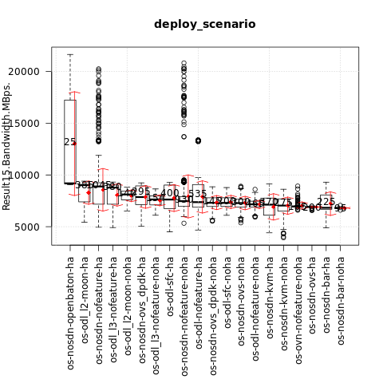
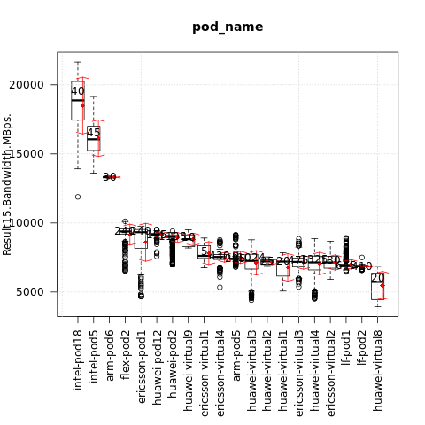
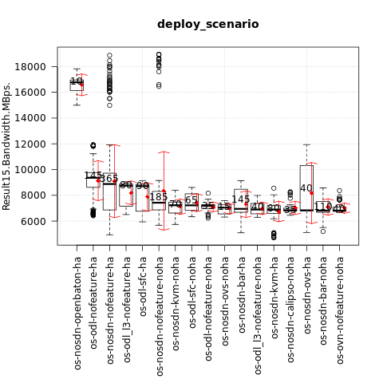
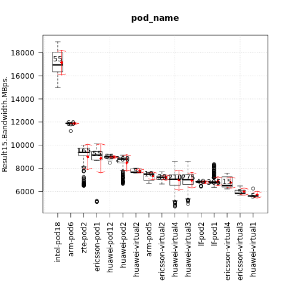

.. This work is licensed under a Creative Commons Attribution 4.0 International
.. License.
.. http://creativecommons.org/licenses/by/4.0

=============================================
Test results for TC069 memory write bandwidth
=============================================

.. toctree::
   :maxdepth: 2

Overview of test case
=====================

TC069 measures the maximum possible cache and memory performance while reading and writing certain
blocks of data (starting from 1Kb and further in power of 2) continuously through ALU and FPU
respectively. Measure different aspects of memory performance via synthetic simulations.
Each simulation consists of four performances (Copy, Scale, Add, Triad).
The test results shown below are for writing 32MB integer block size.

Metric: memory write bandwidth
Unit: MBps

Euphrates release
-----------------

Test results per scenario and pod (higher is better):

{

    "os-nosdn-nofeature-noha:intel-pod18:joid": [20113.395],

    "os-nosdn-openbaton-ha:intel-pod18:joid": [19183.58],

    "os-nosdn-nofeature-ha:intel-pod18:joid": [17851.35],

    "os-nosdn-nofeature-noha:intel-pod5:joid": [16312.37],

    "os-nosdn-nofeature-ha:intel-pod5:joid": [15633.245],

    "os-nosdn-nofeature-ha:arm-pod6:fuel": [13332.065],

    "os-odl-nofeature-ha:arm-pod6:fuel": [13327.02],

    "os-nosdn-nofeature-ha:ericsson-pod1:fuel": [9462.74],

    "os-nosdn-nofeature-ha:flex-pod2:apex": [9384.585],

    "os-odl-nofeature-ha:ericsson-pod1:fuel": [9235.98],

    "os-nosdn-nofeature-noha:huawei-pod12:joid": [9213.6],

    "os-nosdn-openbaton-ha:huawei-pod12:joid": [9152.18],

    "os-nosdn-nofeature-ha:huawei-pod12:joid": [9079.45],

    "os-odl_l2-moon-ha:huawei-pod2:compass": [9071.13],

    "os-nosdn-nofeature-ha:huawei-pod2:compass": [9068.06],

    "os-odl-sfc-ha:huawei-pod2:compass": [9031.24],

    "os-odl_l3-nofeature-ha:huawei-pod2:compass": [9019.53],

    "os-nosdn-bar-ha:huawei-pod2:compass": [8977.3],

    "os-nosdn-ovs_dpdk-ha:huawei-pod2:compass": [8960.635],

    "os-nosdn-nofeature-ha:huawei-virtual9:compass": [8825.805],

    "os-nosdn-kvm-ha:huawei-pod2:compass": [8282.75],

    "os-odl_l2-moon-noha:huawei-virtual4:compass": [8116.33],

    "os-nosdn-ovs-noha:ericsson-virtual4:fuel": [8083.97],

    "os-odl_l2-moon-noha:huawei-virtual3:compass": [8083.52],

    "os-nosdn-nofeature-noha:huawei-virtual3:compass": [7799.145],

    "os-odl_l3-nofeature-noha:huawei-virtual3:compass": [7776.12],

    "os-nosdn-ovs_dpdk-noha:huawei-virtual3:compass": [7680.37],

    "os-nosdn-ovs-noha:ericsson-virtual1:fuel": [7615.97],

    "os-nosdn-nofeature-noha:ericsson-virtual4:fuel": [7612.62],

    "os-nosdn-nofeature-noha:ericsson-virtual2:fuel": [7518.62],

    "os-nosdn-nofeature-noha:huawei-virtual2:compass": [7489.67],

    "os-nosdn-ovs-noha:ericsson-virtual2:fuel": [7478.57],

    "os-nosdn-ovs_dpdk-ha:huawei-virtual4:compass": [7465.82],

    "os-nosdn-kvm-noha:huawei-virtual3:compass": [7443.16],

    "os-odl-nofeature-noha:ericsson-virtual4:fuel": [7442.855],

    "os-nosdn-nofeature-ha:arm-pod5:fuel": [7440.65],

    "os-odl-sfc-noha:huawei-virtual4:compass": [7401.16],

    "os-nosdn-nofeature-ha:huawei-virtual3:compass": [7389.505],

    "os-odl-nofeature-ha:arm-pod5:fuel": [7385.76],

    "os-nosdn-nofeature-noha:huawei-virtual1:compass": [7382.345],

    "os-odl_l2-moon-ha:huawei-virtual3:compass": [7286.385],

    "os-odl_l3-nofeature-noha:huawei-virtual4:compass": [7272.06],

    "os-odl_l3-nofeature-ha:huawei-virtual4:compass": [7261.73],

    "os-nosdn-nofeature-noha:ericsson-virtual3:fuel": [7253.64],

    "os-odl-sfc-noha:huawei-virtual3:compass": [7247.89],

    "os-odl_l3-nofeature-ha:huawei-virtual2:compass": [7214.01],

    "os-nosdn-ovs_dpdk-ha:huawei-virtual3:compass": [7207.39],

    "os-nosdn-ovs_dpdk-noha:huawei-virtual4:compass": [7205.565],

    "os-nosdn-ovs-noha:ericsson-virtual3:fuel": [7201.005],

    "os-nosdn-nofeature-ha:huawei-virtual4:compass": [7132.835],

    "os-odl-nofeature-noha:ericsson-virtual3:fuel": [7117.05],

    "os-odl_l3-nofeature-ha:huawei-virtual3:compass": [7064.18],

    "os-odl_l2-moon-ha:huawei-virtual4:compass": [6997.295],

    "os-odl-nofeature-ha:lf-pod1:apex": [6992.21],

    "os-odl-sfc-ha:huawei-virtual4:compass": [6975.63],

    "os-odl-nofeature-noha:lf-pod1:apex": [6972.63],

    "os-nosdn-nofeature-noha:lf-pod1:apex": [6955],

    "os-ovn-nofeature-noha:lf-pod1:apex": [6954.5],

    "os-nosdn-nofeature-ha:lf-pod1:apex": [6953.35],

    "os-odl-sfc-noha:lf-pod1:apex": [6951.89],

    "os-nosdn-nofeature-ha:huawei-virtual2:compass": [6932.29],

    "os-nosdn-nofeature-noha:huawei-virtual4:compass": [6929.54],

    "os-nosdn-kvm-noha:huawei-virtual4:compass": [6921.6],

    "os-nosdn-ovs-ha:lf-pod2:fuel": [6913.355],

    "os-odl-nofeature-ha:lf-pod2:fuel": [6848.58],

    "os-odl-sfc-ha:lf-pod1:apex": [6818.74],

    "os-nosdn-bar-noha:lf-pod1:apex": [6812.16],

    "os-nosdn-nofeature-ha:lf-pod2:fuel": [6808.18],

    "os-odl-nofeature-noha:ericsson-virtual2:fuel": [6807.565],

    "os-nosdn-bar-ha:lf-pod1:apex": [6774.76],

    "os-nosdn-bar-ha:huawei-virtual4:compass": [6759.4],

    "os-nosdn-nofeature-noha:huawei-virtual8:compass": [6756.9],

    "os-nosdn-bar-ha:huawei-virtual3:compass": [6543.46],

    "os-nosdn-kvm-ha:huawei-virtual3:compass": [6504.34],

    "os-odl-sfc-ha:huawei-virtual3:compass": [6481.005],

    "os-nosdn-kvm-ha:huawei-virtual4:compass": [6461.5],

    "os-nosdn-nofeature-ha:huawei-virtual1:compass": [6152.375],

    "os-odl-sfc-ha:huawei-virtual8:compass": [5941.7],

    "os-nosdn-kvm-noha:huawei-virtual8:compass": [4564.515]

}

The influence of the scenario
^^^^^^^^^^^^^^^^^^^^^^^^^^^^^

{

    "os-nosdn-openbaton-ha": [9187.16],

    "os-odl_l2-moon-ha": [9010.57],

    "os-nosdn-nofeature-ha": [8886.75],

    "os-odl_l3-nofeature-ha": [8779.67],

    "os-odl_l2-moon-noha": [8114.995],

    "os-nosdn-ovs_dpdk-ha": [7864.07],

    "os-odl_l3-nofeature-noha": [7632.11],

    "os-odl-sfc-ha": [7624.67],

    "os-nosdn-nofeature-noha": [7470.66],

    "os-odl-nofeature-ha": [7372.23],

    "os-nosdn-ovs_dpdk-noha": [7311.54],

    "os-odl-sfc-noha": [7300.56],

    "os-nosdn-ovs-noha": [7280.005],

    "os-odl-nofeature-noha": [7162.67],

    "os-nosdn-kvm-ha": [7130.775],

    "os-nosdn-kvm-noha": [7041.13],

    "os-ovn-nofeature-noha": [6954.5],

    "os-nosdn-ovs-ha": [6913.355],

    "os-nosdn-bar-ha": [6829.17],

    "os-nosdn-bar-noha": [6812.16]

}

The influence of the POD
^^^^^^^^^^^^^^^^^^^^^^^^

{

    "intel-pod18": [18871.79],

    "intel-pod5": [16055.79],

    "arm-pod6": [13327.02],

    "flex-pod2": [9384.585],

    "ericsson-pod1": [9331.535],

    "huawei-pod12": [9164.88],

    "huawei-pod2": [9026.52],

    "huawei-virtual9": [8825.805],

    "ericsson-virtual1": [7615.97],

    "ericsson-virtual4": [7539.23],

    "arm-pod5": [7403.38],

    "huawei-virtual3": [7247.89],

    "huawei-virtual2": [7205.35],

    "huawei-virtual1": [7196.405],

    "ericsson-virtual3": [7173.72],

    "huawei-virtual4": [7131.47],

    "ericsson-virtual2": [7129.08],

    "lf-pod1": [6928.18],

    "lf-pod2": [6875.88],

    "huawei-virtual8": [5729.705]

}

Fraser release
--------------

Test results per scenario and pod (higher is better):

{

    "os-nosdn-nofeature-noha:intel-pod18:joid": [18382.49],

    "os-nosdn-openbaton-ha:intel-pod18:joid": [16774.52],

    "os-nosdn-nofeature-ha:intel-pod18:joid": [16680.305],

    "os-nosdn-ovs-ha:arm-pod6:fuel": [11925.22],

    "os-nosdn-nofeature-ha:arm-pod6:fuel": [11895.71],

    "os-odl-nofeature-ha:arm-pod6:fuel": [11880.7],

    "os-nosdn-nofeature-ha:ericsson-pod1:fuel": [9471.095],

    "os-odl-nofeature-ha:zte-pod2:daisy": [9375.33],

    "os-nosdn-nofeature-ha:zte-pod2:daisy": [9372.95],

    "os-odl-nofeature-ha:ericsson-pod1:fuel": [9174.36],

    "os-nosdn-nofeature-noha:huawei-pod12:joid": [9051.57],

    "os-nosdn-nofeature-ha:huawei-pod12:joid": [8894.74],

    "os-odl_l3-nofeature-ha:huawei-pod2:compass": [8857.23],

    "os-nosdn-nofeature-ha:huawei-pod2:compass": [8855.8],

    "os-nosdn-bar-ha:huawei-pod2:compass": [8840.94],

    "os-odl-sfc-ha:huawei-pod2:compass": [8826.23],

    "os-nosdn-nofeature-noha:huawei-virtual4:compass": [8039.48],

    "os-nosdn-nofeature-noha:huawei-virtual2:compass": [7670.21],

    "os-nosdn-ovs-ha:arm-pod5:fuel": [7590.9],

    "os-odl-sfc-noha:huawei-virtual4:compass": [7579.625],

    "os-nosdn-bar-noha:huawei-virtual3:compass": [7511.775],

    "os-odl-nofeature-ha:arm-pod5:fuel": [7475.16],

    "os-nosdn-bar-noha:huawei-virtual4:compass": [7435.08],

    "os-nosdn-nofeature-noha:ericsson-virtual2:fuel": [7426.79],

    "os-nosdn-nofeature-ha:huawei-virtual4:compass": [7362.8],

    "os-nosdn-kvm-noha:huawei-virtual4:compass": [7263.45],

    "os-nosdn-nofeature-noha:huawei-virtual3:compass": [7262.72],

    "os-odl_l3-nofeature-noha:huawei-virtual3:compass": [7241.07],

    "os-odl-nofeature-noha:ericsson-virtual2:fuel": [7219.21],

    "os-nosdn-kvm-noha:huawei-virtual3:compass": [7174.33],

    "os-odl-sfc-noha:huawei-virtual3:compass": [7170.795],

    "os-odl-nofeature-noha:lf-pod1:apex": [7158.335],

    "os-nosdn-kvm-ha:huawei-pod2:compass": [7122.45],

    "os-odl-sfc-ha:huawei-virtual4:compass": [7104.9],

    "os-nosdn-ovs-noha:ericsson-virtual2:fuel": [7044.37],

    "os-nosdn-bar-ha:huawei-virtual3:compass": [7011.075],

    "os-nosdn-ovs-ha:ericsson-pod1:fuel": [6950.28],

    "os-nosdn-ovs-noha:ericsson-virtual4:fuel": [6918.31],

    "os-nosdn-bar-ha:huawei-virtual4:compass": [6903.11],

    "os-nosdn-nofeature-ha:lf-pod2:fuel": [6880.98],

    "os-odl-sfc-ha:lf-pod1:apex": [6863.39],

    "os-odl_l3-nofeature-ha:huawei-virtual3:compass": [6851.54],

    "os-nosdn-nofeature-noha:lf-pod1:apex": [6834.75],

    "os-nosdn-calipso-noha:lf-pod1:apex": [6833.92],

    "os-nosdn-ovs-ha:lf-pod2:fuel": [6814.68],

    "os-ovn-nofeature-noha:lf-pod1:apex": [6809.44],

    "os-odl_l3-nofeature-ha:huawei-virtual4:compass": [6784.48],

    "os-nosdn-nofeature-ha:lf-pod1:apex": [6737.64],

    "os-nosdn-bar-noha:lf-pod1:apex": [6708.61],

    "os-nosdn-bar-ha:lf-pod1:apex": [6697.2],

    "os-odl-nofeature-ha:lf-pod1:apex": [6626.51],

    "os-odl-sfc-noha:lf-pod1:apex": [6609.57],

    "os-odl-sfc-ha:huawei-virtual3:compass": [6606.87],

    "os-odl_l3-nofeature-noha:huawei-virtual4:compass": [6547.39],

    "os-odl-nofeature-ha:lf-pod2:fuel": [6465.48],

    "os-odl-nofeature-noha:ericsson-virtual4:fuel": [6413],

    "os-nosdn-kvm-ha:huawei-virtual4:compass": [6409.075],

    "os-nosdn-nofeature-ha:huawei-virtual3:compass": [6128.79],

    "os-nosdn-nofeature-noha:ericsson-virtual3:fuel": [5835.59],

    "os-nosdn-nofeature-ha:huawei-virtual1:compass": [5617.12]

}

The influence of the scenario
^^^^^^^^^^^^^^^^^^^^^^^^^^^^^

{

    "os-nosdn-openbaton-ha": [16774.52],

    "os-odl-nofeature-ha": [9363.69],

    "os-nosdn-nofeature-ha": [8878.01],

    "os-odl_l3-nofeature-ha": [8748.4],

    "os-odl-sfc-ha": [8708.045],

    "os-nosdn-nofeature-noha": [7426.79],

    "os-nosdn-kvm-noha": [7230.79],

    "os-odl-sfc-noha": [7224.11],

    "os-odl-nofeature-noha": [7187.84],

    "os-nosdn-ovs-noha": [7044.37],

    "os-nosdn-bar-ha": [6947.87],

    "os-odl_l3-nofeature-noha": [6895.96],

    "os-nosdn-kvm-ha": [6890.92],

    "os-nosdn-calipso-noha": [6833.92],

    "os-nosdn-ovs-ha": [6833.495],

    "os-nosdn-bar-noha": [6811.66],

    "os-ovn-nofeature-noha": [6809.44]

}

The influence of the POD
^^^^^^^^^^^^^^^^^^^^^^^^

{

    "intel-pod18": [16939.24],

    "arm-pod6": [11895.71],

    "zte-pod2": [9375.33],

    "ericsson-pod1": [9140.42],

    "huawei-pod12": [8993.37],

    "huawei-pod2": [8794.01],

    "huawei-virtual2": [7670.21],

    "arm-pod5": [7479.32],

    "ericsson-virtual2": [7219.21],

    "huawei-virtual4": [7059.045],

    "huawei-virtual3": [7023.57],

    "lf-pod2": [6834.7],

    "lf-pod1": [6775.27],

    "ericsson-virtual4": [6522.86],

    "ericsson-virtual3": [5835.59],

    "huawei-virtual1": [5617.12]

}
