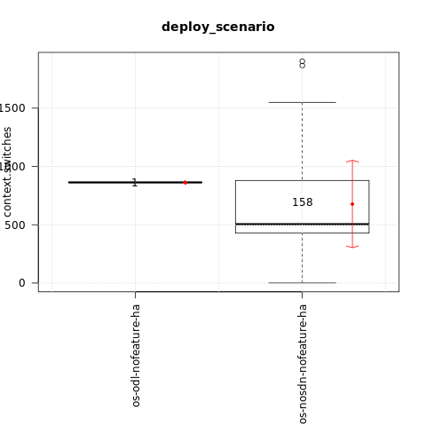
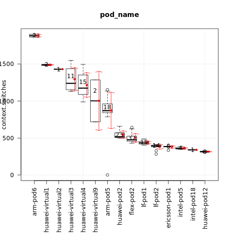
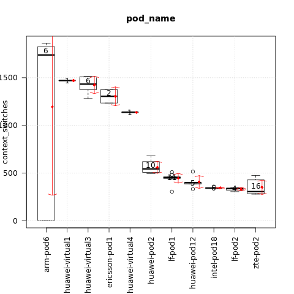

.. This work is licensed under a Creative Commons Attribution 4.0 International
.. License.
.. http://creativecommons.org/licenses/by/4.0

==================================================
Test results for TC082 context switches under load
==================================================

.. toctree::
   :maxdepth: 2

Overview of test case
=====================

TC082 measures various software performance events using perf.
The test results shown below are for context-switches.

Metric: context switches
Unit: N/A

Euphrates release
-----------------

Test results per scenario and pod (lower is better):

{

    "os-nosdn-nofeature-ha:huawei-pod12:joid": [316],

    "os-nosdn-nofeature-ha:intel-pod18:joid": [340],

    "os-nosdn-nofeature-ha:intel-pod5:joid": [357.5],

    "os-nosdn-nofeature-ha:ericsson-pod1:fuel": [384],

    "os-nosdn-nofeature-ha:lf-pod2:fuel": [394.5],

    "os-nosdn-nofeature-ha:lf-pod1:apex": [435],

    "os-nosdn-nofeature-ha:flex-pod2:apex": [476],

    "os-nosdn-nofeature-ha:huawei-pod2:compass": [518],

    "os-odl-nofeature-ha:arm-pod5:fuel": [863],

    "os-nosdn-nofeature-ha:arm-pod5:fuel": [871],

    "os-nosdn-nofeature-ha:huawei-virtual9:compass": [1002],

    "os-nosdn-nofeature-ha:huawei-virtual4:compass": [1174],

    "os-nosdn-nofeature-ha:huawei-virtual3:compass": [1239],

    "os-nosdn-nofeature-ha:huawei-virtual2:compass": [1430],

    "os-nosdn-nofeature-ha:huawei-virtual1:compass": [1489],

    "os-nosdn-nofeature-ha:arm-pod6:fuel": [1883.5]

}

The influence of the scenario
^^^^^^^^^^^^^^^^^^^^^^^^^^^^^

{

    "os-nosdn-nofeature-ha": [505],

    "os-odl-nofeature-ha": [863]

}

The influence of the POD
^^^^^^^^^^^^^^^^^^^^^^^^

{

    "huawei-pod12": [316],

    "intel-pod18": [340],

    "intel-pod5": [357.5],

    "ericsson-pod1": [384],

    "lf-pod2": [394.5],

    "lf-pod1": [435],

    "flex-pod2": [476],

    "huawei-pod2": [518],

    "arm-pod5": [869.5],

    "huawei-virtual9": [1002],

    "huawei-virtual4": [1174],

    "huawei-virtual3": [1239],

    "huawei-virtual2": [1430],

    "huawei-virtual1": [1489],

    "arm-pod6": [1883.5]

}

Fraser release
--------------

Test results per scenario and pod (lower is better):

{

    "os-nosdn-nofeature-ha:zte-pod2:daisy": [306.5],

    "os-nosdn-nofeature-ha:lf-pod2:fuel": [337.5],

    "os-nosdn-nofeature-ha:intel-pod18:joid": [343.5],

    "os-nosdn-nofeature-ha:huawei-pod12:joid": [399],

    "os-nosdn-nofeature-ha:lf-pod1:apex": [454],

    "os-nosdn-nofeature-ha:huawei-pod2:compass": [544.5],

    "os-nosdn-nofeature-ha:huawei-virtual4:compass": [1138],

    "os-nosdn-nofeature-ha:ericsson-pod1:fuel": [1305],

    "os-nosdn-nofeature-ha:huawei-virtual3:compass": [1433],

    "os-nosdn-nofeature-ha:huawei-virtual1:compass": [1470],

    "os-nosdn-nofeature-ha:arm-pod6:fuel": [1738.5]

}

The influence of the POD
^^^^^^^^^^^^^^^^^^^^^^^^

{

    "zte-pod2": [306.5],

    "lf-pod2": [337.5],

    "intel-pod18": [343.5],

    "huawei-pod12": [399],

    "lf-pod1": [454],

    "huawei-pod2": [544.5],

    "huawei-virtual4": [1138],

    "ericsson-pod1": [1305],

    "huawei-virtual3": [1433],

    "huawei-virtual1": [1470],

    "arm-pod6": [1738.5]

}
