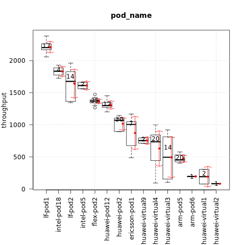
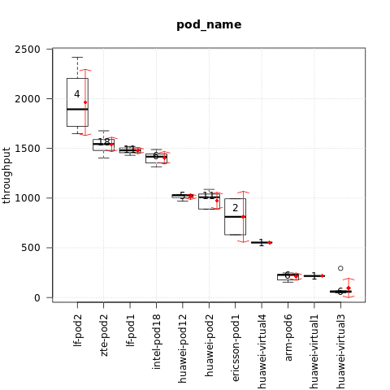

.. This work is licensed under a Creative Commons Attribution 4.0 International
.. License.
.. http://creativecommons.org/licenses/by/4.0

=====================================================
Test results for TC083 network throughput between VMs
=====================================================

.. toctree::
   :maxdepth: 2

Overview of test case
=====================

TC083 measures network latency and throughput between VMs using netperf.
The test results shown below are for UDP throughout.

Metric: UDP stream throughput
Unit: 10^6bits/s

Euphrates release
-----------------

Test results per scenario and pod (higher is better):

{

    "os-nosdn-nofeature-ha:lf-pod1:apex": [2204.42],

    "os-nosdn-nofeature-ha:intel-pod18:joid": [1835.55],

    "os-nosdn-nofeature-ha:lf-pod2:fuel": [1676.705],

    "os-nosdn-nofeature-ha:intel-pod5:joid": [1612.555],

    "os-nosdn-nofeature-ha:flex-pod2:apex": [1370.23],

    "os-nosdn-nofeature-ha:huawei-pod12:joid": [1300.12],

    "os-nosdn-nofeature-ha:huawei-pod2:compass": [1070.455],

    "os-nosdn-nofeature-ha:ericsson-pod1:fuel": [1004.32],

    "os-nosdn-nofeature-ha:huawei-virtual9:compass": [753.46],

    "os-nosdn-nofeature-ha:huawei-virtual4:compass": [735.07],

    "os-odl-nofeature-ha:arm-pod5:fuel": [531.63],

    "os-nosdn-nofeature-ha:huawei-virtual3:compass": [493.985],

    "os-nosdn-nofeature-ha:arm-pod5:fuel": [448.82],

    "os-nosdn-nofeature-ha:arm-pod6:fuel": [193.43],

    "os-nosdn-nofeature-ha:huawei-virtual1:compass": [189.99],

    "os-nosdn-nofeature-ha:huawei-virtual2:compass": [80.15]

}

The influence of the scenario
^^^^^^^^^^^^^^^^^^^^^^^^^^^^^

{

    "os-nosdn-nofeature-ha": [1109.12],

    "os-odl-nofeature-ha": [531.63]

}

The influence of the POD
^^^^^^^^^^^^^^^^^^^^^^^^

{

    "lf-pod1": [2204.42],

    "intel-pod18": [1835.55],

    "lf-pod2": [1676.705],

    "intel-pod5": [1612.555],

    "flex-pod2": [1370.23],

    "huawei-pod12": [1300.12],

    "huawei-pod2": [1070.455],

    "ericsson-pod1": [1004.32],

    "huawei-virtual9": [753.46],

    "huawei-virtual4": [735.07],

    "huawei-virtual3": [493.985],

    "arm-pod5": [451.38],

    "arm-pod6": [193.43],

    "huawei-virtual1": [189.99],

    "huawei-virtual2": [80.15]

}

Fraser release
--------------

Test results per scenario and pod (higher is better):

{

    "os-nosdn-nofeature-ha:lf-pod2:fuel": [1893.39],

    "os-nosdn-nofeature-ha:zte-pod2:daisy": [1543.995],

    "os-nosdn-nofeature-ha:lf-pod1:apex": [1480.86],

    "os-nosdn-nofeature-ha:intel-pod18:joid": [1417.015],

    "os-nosdn-nofeature-ha:huawei-pod12:joid": [1028.55],

    "os-nosdn-nofeature-ha:huawei-pod2:compass": [1007.65],

    "os-nosdn-nofeature-ha:ericsson-pod1:fuel": [811.795],

    "os-nosdn-nofeature-ha:huawei-virtual4:compass": [552.95],

    "os-nosdn-nofeature-ha:arm-pod6:fuel": [227.655],

    "os-nosdn-nofeature-ha:huawei-virtual1:compass": [216.63],

    "os-nosdn-nofeature-ha:huawei-virtual3:compass": [59.255]

}

The influence of the POD
^^^^^^^^^^^^^^^^^^^^^^^^

{

    "lf-pod2": [1893.39],

    "zte-pod2": [1543.995],

    "lf-pod1": [1480.86],

    "intel-pod18": [1417.015],

    "huawei-pod12": [1028.55],

    "huawei-pod2": [1007.65],

    "ericsson-pod1": [811.795],

    "huawei-virtual4": [552.95],

    "arm-pod6": [227.655],

    "huawei-virtual1": [216.63],

    "huawei-virtual3": [59.255]

}
