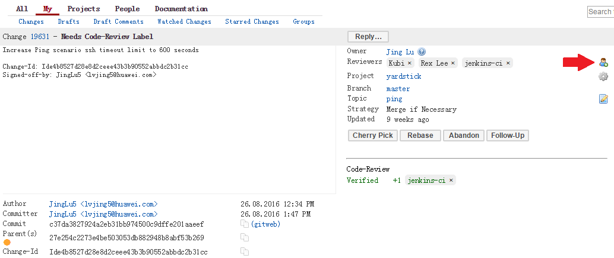

Introduction
=============

Yardstick is a project dealing with performance testing. Yardstick produces its own test cases but can also be considered as a framework to support feature project testing.

Yardstick developed a test API that can be used by any OPNFV project. Therefore there are many ways to contribute to Yardstick.

You can:

* Develop new test cases
* Review codes
* Develop Yardstick API / framework
* Develop Yardstick grafana dashboards and  Yardstick reporting page
* Write Yardstick documentation

This developer guide describes how to interact with the Yardstick project.
The first section details the main working areas of the project. The Second
part is a list of “How to” to help you to join the Yardstick family whatever
your field of interest is.

Where can I find some help to start?
--------------------------------------

.. _`user guide`: http://artifacts.opnfv.org/yardstick/danube/1.0/docs/stesting_user_userguide/index.html
.. _`wiki page`: https://wiki.opnfv.org/display/yardstick/

This guide is made for you. You can have a look at the `user guide`_.
There are also references on documentation, video tutorials, tips in the
project `wiki page`_. You can also directly contact us by mail with [Yardstick] prefix in the title at opnfv-tech-discuss@lists.opnfv.org or on the IRC chan #opnfv-yardstick.

Yardstick developer areas
==========================

Yardstick framework
--------------------

Yardstick can be considered as a framework. Yardstick is release as a docker
file, including tools, scripts and a CLI to prepare the environement and run
tests. It simplifies the integration of external test suites in CI pipeline
and provide commodity tools to collect and display results.

Since Danube, test categories also known as tiers have been created to group
similar tests, provide consistant sub-lists and at the end optimize test
duration for CI (see How To section).

The definition of the tiers has been agreed by the testing working group.

The tiers are:

* smoke
* features
* components
* performance
* vnf

How Todos?
===========

How Yardstick works?
---------------------

The installation and configuration of the Yardstick is described in the `user guide`_.

How can I contribute to Yardstick?
-----------------------------------

If you are already a contributor of any OPNFV project, you can contribute to
Yardstick. If you are totally new to OPNFV, you must first create your Linux
Foundation account, then contact us in order to declare you in the repository
database.

We distinguish 2 levels of contributors:

* the standard contributor can push patch and vote +1/0/-1 on any Yardstick patch
* The commitor can vote -2/-1/0/+1/+2 and merge

Yardstick commitors are promoted by the Yardstick contributors.

Gerrit & JIRA introduction
^^^^^^^^^^^^^^^^^^^^^^^^^^^^^

.. _Gerrit: https://www.gerritcodereview.com/
.. _`OPNFV Gerrit`: http://gerrit.opnfv.org/
.. _link: https://identity.linuxfoundation.org/
.. _JIRA: https://jira.opnfv.org/secure/Dashboard.jspa

OPNFV uses Gerrit_ for web based code review and repository management for the
Git Version Control System. You can access `OPNFV Gerrit`_. Please note that
you need to have Linux Foundation ID in order to use OPNFV Gerrit. You can get one from this link_.

OPNFV uses JIRA_ for issue management. An important principle of change
management is to have two-way trace-ability between issue management
(i.e. JIRA_) and the code repository (via Gerrit_). In this way, individual
commits can be traced to JIRA issues and we also know which commits were used
to resolve a JIRA issue.

If you want to contribute to Yardstick, you can pick a issue from Yardstick's
JIRA dashboard or you can create you own issue and submit it to JIRA.

Install Git and Git-reviews
^^^^^^^^^^^^^^^^^^^^^^^^^^^^^

Installing and configuring Git and Git-Review is necessary in order to submit
code to Gerrit. The `Getting to the code <https://wiki.opnfv.org/display/DEV/Developer+Getting+Started>`_ page will provide you with some help for that.

Verify your patch locally before submitting
^^^^^^^^^^^^^^^^^^^^^^^^^^^^^^^^^^^^^^^^^^^^

Once you finish a patch, you can submit it to Gerrit for code review. A
developer sends a new patch to Gerrit will trigger patch verify job on Jenkins
CI. The yardstick patch verify job includes python flake8 check, unit test and
code coverage test. Before you submit your patch, it is recommended to run the
patch verification in your local environment first.

Open a terminal window and set the project's directory to the working
directory using the ``cd`` command. Assume that ``YARDSTICK_REPO_DIR`` is the path to the Yardstick project folder on your computer::

  cd $YARDSTICK_REPO_DIR

Verify your patch::

  ./run_tests.sh

It is used in CI but also by the CLI.

Submit the code with Git
^^^^^^^^^^^^^^^^^^^^^^^^^^^^^

Tell Git which files you would like to take into account for the next commit.
This is called 'staging' the files, by placing them into the staging area,
using the ``git add`` command (or the synonym ``git stage`` command)::

  git add $YARDSTICK_REPO_DIR/samples/sample.yaml

Alternatively, you can choose to stage all files that have been modified (that
is the files you have worked on) since the last time you generated a commit,
by using the `-a` argument::

  git add -a

Git won't let you push (upload) any code to Gerrit if you haven't pulled the
latest changes first. So the next step is to pull (download) the latest
changes made to the project by other collaborators using the ``pull`` command::

  git pull

Now that you have the latest version of the project and you have staged the
files you wish to push, it is time to actually commit your work to your local
Git repository::

  git commit --signoff -m "Title of change"

  Test of change that describes in high level what was done. There is a lot of
  documentation in code so you do not need to repeat it here.

  JIRA: YARDSTICK-XXX

.. _`this document`: http://chris.beams.io/posts/git-commit/

The message that is required for the commit should follow a specific set of
rules. This practice allows to standardize the description messages attached
to the commits, and eventually navigate among the latter more easily.

`This document`_ happened to be very clear and useful to get started with that.

Push the code to Gerrit for review
^^^^^^^^^^^^^^^^^^^^^^^^^^^^^^^^^^^^^^^^

Now that the code has been comitted into your local Git repository the
following step is to push it online to Gerrit for it to be reviewed. The
command we will use is ``git review``::

  git review

This will automatically push your local commit into Gerrit. You can add
Yardstick committers and contributors to review your codes.

You can find Yardstick people info `here <https://wiki.opnfv.org/display/yardstick/People>`_.

Modify the code under review in Gerrit
^^^^^^^^^^^^^^^^^^^^^^^^^^^^^^^^^^^^^^^^^^^

At the same time the code is being reviewed in Gerrit, you may need to edit it
to make some changes and then send it back for review. The following steps go
through the procedure.

Once you have modified/edited your code files under your IDE, you will have to
stage them. The 'status' command is very helpful at this point as it provides
an overview of Git's current state::

  git status

The output of the command provides us with the files that have been modified
after the latest commit.

You can now stage the files that have been modified as part of the Gerrit code
review edition/modification/improvement using ``git add`` command. It is now
time to commit the newly modified files, but the objective here is not to
create a new commit, we simply want to inject the new changes into the
previous commit. You can achieve that with the '--amend' option on the
``git commit`` command::

  git commit --amend

If the commit was successful, the ``git status`` command should not return the
updated files as about to be commited.

The final step consists in pushing the newly modified commit to Gerrit::

  git review

Plugins
==========

For information about Yardstick plugins, refer to the chapter **Installing a plug-in into Yardstick** in the `user guide`_.

