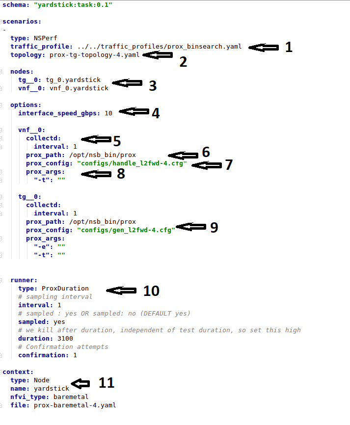

Introduction
=============

This document describes the steps to create a new NSB PROX test based on
existing PROX functionalities. NSB PROX provides is a simple approximation
of an operation and can be used to develop best practices and TCO models
for Telco customers, investigate the impact of new Intel compute,
network and storage technologies, characterize performance, and develop
optimal system architectures and configurations.

.. contents::

Prerequisites
=============

In order to integrate PROX tests into NSB, the following prerequisites are required.

.. _`dpdk wiki page`: http://dpdk.org/
.. _`yardstick wiki page`: https://wiki.opnfv.org/display/yardstick/
.. _`Prox documentation`: https://01.org/intel-data-plane-performance-demonstrators/documentation/prox-documentation
.. _`openstack wiki page`: https://wiki.openstack.org/wiki/Main_Page
.. _`grafana getting started`: http://docs.grafana.org/guides/gettingstarted/
.. _`opnfv grafana dashboard`: https://wiki.opnfv.org/display/yardstick/How+to+work+with+grafana+dashboard
.. _`Prox command line`: https://01.org/intel-data-plane-performance-demonstrators/documentation/prox-documentation#Command_line_options
.. _`grafana deployment`: https://wiki.opnfv.org/display/yardstick/How+to+deploy+InfluxDB+and+Grafana+locally
.. _`Prox options`: https://01.org/intel-data-plane-performance-demonstrators/documentation/prox-documentation#.5Beal_options.5D
.. _`NSB Installation`: http://artifacts.opnfv.org/yardstick/docs/userguide/index.html#document-09-installation

* A working knowledge of Yardstick. See `yardstick wiki page`_.
* A working knowledge of PROX. See `Prox documentation`_.
* Knowledge of Openstack. See `openstack wiki page`_.
* Knowledge of how to use Grafana. See `grafana getting started`_.
* How to Deploy InfluxDB & Grafana. See `grafana deployment`_.
* How to use Grafana in OPNFV/Yardstick. See `opnfv grafana dashboard`_.
* How to install NSB. See `NSB Installation`_

Sample Prox Test Hardware Architecture
======================================

The following is a diagram of a sample NSB PROX Hardware Architecture
for both NSB PROX on Bare metal and on Openstack.

In this example when running yardstick on baremetal, yardstick will
run on the deployment node, the generator will run on the deployment node
and the SUT(SUT) will run on the Controller Node.


.. image:: images/PROX_Hardware_Arch.png
   :width: 800px
   :alt: Sample NSB PROX Hard Architecture

Prox Test Architecture
======================

In order to create a new test, one must understand the architecture of
the test.

A NSB Prox test architecture is composed of:

* A traffic generator. This provides blocks of data on 1 or more ports
  to the SUT.
  The traffic generator also consumes the result packets from the system
  under test.
* A SUT consumes the packets generated by the packet
  generator, and applies one or more tasks to the packets and return the
  modified packets to the traffic generator.

  This is an example of a sample NSB PROX test architecture.


This diagram is of a sample NSB PROX test application.

* Traffic Generator

  * Generator Tasks - Composted of 1 or more tasks (It is possible to
    have multiple tasks sending packets to same port No. See Tasks Ai and Aii
    plus Di and Dii)

    * Task Ai - Generates Packets on Port 0 of Traffic Generator
      and send to Port 0 of SUT Port 0
    * Task Aii - Generates Packets on Port 0 of Traffic Generator
      and send to Port 0 of SUT Port 0
    * Task B - Generates Packets on Port 1 of Traffic Generator
      and send to Port 1 of SUT Port 1
    * Task C - Generates Packets on Port 2 of Traffic Generator
      and send to Port 2 of SUT Port 2
    * Task Di - Generates Packets on Port 3 of Traffic Generator
      and send to Port 3 of SUT Port 3
    * Task Dii - Generates Packets on Port 0 of Traffic Generator
      and send to Port 0 of SUT Port 0

  * Verifier Tasks - Composed of 1 or more tasks which receives
    packets from SUT

    * Task E - Receives packets on Port 0 of Traffic Generator sent
      from Port 0 of SUT Port 0
    * Task F - Receives packets on Port 1 of Traffic Generator sent
      from Port 1 of SUT Port 1
    * Task G - Receives packets on Port 2 of Traffic Generator sent
      from Port 2 of SUT Port 2
    * Task H - Receives packets on Port 3 of Traffic Generator sent
      from Port 3 of SUT Port 3

* SUT

  * Receiver Tasks - Receives packets from generator - Composed on 1 or
    more tasks which consume the packs sent from Traffic Generator

    * Task A - Receives Packets on Port 0 of System-Under-Test from
      Traffic Generator Port 0, and forwards packets to Task E
    * Task B - Receives Packets on Port 1 of System-Under-Test from
      Traffic Generator Port 1, and forwards packets to Task E
    * Task C - Receives Packets on Port 2 of System-Under-Test from
      Traffic Generator Port 2, and forwards packets to Task E
    * Task D - Receives Packets on Port 3 of System-Under-Test from
      Traffic Generator Port 3, and forwards packets to Task E

  * Processing Tasks - Composed of multiple tasks in series which carry
    out some processing on received packets before forwarding to the
    task.

    * Task E - This receives packets from the Receiver Tasks,
      carries out some operation on the data and forwards to result
      packets to the next task in the sequence - Task F
    * Task F - This receives packets from the previous Task - Task
      E, carries out some operation on the data and forwards to result
      packets to the next task in the sequence - Task G
    * Task G - This receives packets from the previous Task - Task F
      and distributes the result packages to the Transmitter tasks

  * Transmitter Tasks - Composed on 1 or more tasks which send the
    processed packets back to the Traffic Generator

    * Task H - Receives Packets from Task G of System-Under-Test and
      sends packets to Traffic Generator Port 0
    * Task I - Receives Packets from Task G of System-Under-Test and
      sends packets to Traffic Generator Port 1
    * Task J - Receives Packets from Task G of System-Under-Test and
      sends packets to Traffic Generator Port 2
    * Task K - Receives Packets From Task G of System-Under-Test and
      sends packets to Traffic Generator Port 3

NSB Prox Test
=============

A NSB Prox test is composed of the following components :-

* Test Description File. Usually called
  ``tc_prox_<context>_<test>-<ports>.yaml`` where

  * <context> is either ``baremetal`` or ``heat_context``
  * <test> is the a one or 2 word description of the test.
  * <ports> is the number of ports used

  Example tests ``tc_prox_baremetal_l2fwd-2.yaml`` or
  ``tc_prox_heat_context_vpe-4.yaml``. This file describes the components
  of the test, in the case of openstack the network description and
  server descriptions, in the case of baremetal the hardware
  description location. It also contains the name of the Traffic Generator, the SUT config file
  and the traffic profile description, all described below. See nsb-test-description-label_

* Traffic Profile file. Example ``prox_binsearch.yaml``. This describes the packet size, tolerated
  loss, initial line rate to start traffic at, test interval etc See nsb-traffic-profile-label_

* Traffic Generator Config file. Usually called ``gen_<test>-<ports>.cfg``.

  This describes the activity of the traffic generator

  * What each core of the traffic generator does,
  * The packet of data sent by a core on a port of the traffic generator
    to the system under test
  * What core is used to wait on what port for data from the system
    under test.

  Example traffic generator config file  ``gen_l2fwd-4.cfg``
  See nsb-traffic-generator-label_

* SUT Config file. Usually called ``handle_<test>-<ports>.cfg``.

  This describes the activity of the SUTs

  * What each core of the  does,
  * What cores receives packets from what ports
  * What cores perform operations on the packets and pass the packets onto
    another core
  * What cores receives packets from what cores and transmit the packets on
    the ports to the Traffic Verifier tasks of the Traffic Generator.

  Example traffic generator config file  ``handle_l2fwd-4.cfg``
  See nsb-sut-generator-label_

* NSB PROX Baremetal Configuration file. Usually called
  ``prox-baremetal-<ports>.yaml``

  * <ports> is the number of ports used

  This is required for baremetal only.  This describes hardware, NICs,
  IP addresses, Network drivers, usernames and passwords.
  See baremetal-config-label_

* Grafana Dashboard. Usually called
  ``Prox_<context>_<test>-<port>-<DateAndTime>.json`` where

  * <context> Is either ``BM`` or ``heat``
  * <test> Is the a one or 2 word description of the test.
  * <port> is the number of ports used express as ``2Port`` or ``4Port``
  * <DateAndTime> is the Date and Time expressed as a string.

  Example grafana dashboard ``Prox_BM_L2FWD-4Port-1507804504588.json``

Other files may be required. These are test specific files and will be
covered later.

.. _nsb-test-description-label:

**Test Description File**

Here we will discuss the test description for both
baremetal and openstack.

*Test Description File for Baremetal*
-------------------------------------

This section will introduce the meaning of the Test case description
file. We will use ``tc_prox_baremetal_l2fwd-2.yaml`` as an example to
show you how to understand the test description file.



Now let's examine the components of the file in detail

1. ``traffic_profile`` - This specifies the traffic profile for the
   test. In this case ``prox_binsearch.yaml`` is used. See nsb-traffic-profile-label_

2. ``topology`` - This is either ``prox-tg-topology-1.yaml`` or
    ``prox-tg-topology-2.yaml`` or ``prox-tg-topology-4.yaml``
    depending on number of ports required.

3. ``nodes`` - This names the Traffic Generator and the System
   under Test. Does not need to change.

4. ``prox_path`` - Location of the Prox executable on the traffic
   generator (Either baremetal or Openstack Virtual Machine)

5. ``prox_config`` - This is the ``SUT Config File``.
   In this case it is ``handle_l2fwd-2.cfg``

   A number of additional parameters can be added. This example
   is taken from VPE::

    options:
      vnf__0:
        prox_path: /opt/nsb_bin/prox
        prox_config: ``configs/handle_vpe-4.cfg``
        prox_args:
          ``-t``: ````
        prox_files:
          ``configs/vpe_ipv4.lua`` : ````
          ``configs/vpe_dscp.lua`` : ````
          ``configs/vpe_cpe_table.lua`` : ````
          ``configs/vpe_user_table.lua`` : ````
          ``configs/vpe_rules.lua`` : ````
        prox_generate_parameter: True

   ``prox_files`` - this specified that a number of addition files
   need to be provided for the test to run correctly. This files
   could provide routing information,hashing information or a
   hashing algorithm and ip/mac information.

   ``prox_generate_parameter`` - this specifies that the NSB application
   is required to provide information to the nsb Prox in the form
   of a file called ``parameters.lua``, which contains information
   retrieved from either the hardware or the openstack configuration.

6. ``prox_args`` - this specifies the command line arguments to start
   prox. See `prox command line`_.

7. ``prox_config`` - This specifies the Traffic Generator config file.

8. ``runner`` - This is set to ``Duration`` - This specified that the
   test run for a set duration. Other runner types are available
   but it is recommend to use ``Duration``

9. ``context`` - This is ``context`` for a 2 port Baremetal configuration.
   If a 4 port configuration was required then file
   ``prox-baremetal-4.yaml`` would be used. This is the NSB Prox
   baremetal configuration file.

.. _nsb-traffic-profile-label:

*Traffic Profile file*
----------------------

This describes the details of the traffic flow. In this case ``prox_binsearch.yaml`` is used.


1. ``name`` - The name of the traffic profile. This name should match the name specified in the
   ``traffic_profile`` field in the Test Description File.

2. ``traffic_type`` - This specifies the type of traffic pattern generated, This name matches
   class name of the traffic generator See::

      network_services/traffic_profile/prox_binsearch.py class ProxBinSearchProfile(ProxProfile)

   In this case it lowers the traffic rate until the number of packets
   sent is equal to the number of packets received (plus a
   tolerated loss). Once it achieves this it increases the traffic
   rate in order to find the highest rate with no traffic loss.

   Custom traffic types can be created by creating a new traffic profile class.

3. ``tolerated_loss`` - This specifies the percentage of packets that can be lost/dropped before
   we declare success or failure. Success is Transmitted-Packets from Traffic Generator is greater than or equal to
   packets received by Traffic Generator plus tolerated loss.

4. ``test_precision`` - This specifies the precision of the test results. For some tests the success criteria
   may never be achieved because the test precision may be greater than the successful throughput. For finer
   results increase the precision by making this value smaller.

5. ``packet_sizes`` - This specifies the range of packets size this test is run for.

6. ``duration`` - This specifies the sample duration that the test uses to check for success or failure.

7. ``lower_bound`` - This specifies the test initial lower bound sample rate. On success this value is increased.

8. ``upper_bound`` - This specifies the test initial upper bound sample rate. On success this value is decreased.

Other traffic profiles exist eg prox_ACL.yaml which does not
compare what is received with what is transmitted. It just
sends packet at max rate.

It is possible to create custom traffic profiles with by
creating new file in the same folder as prox_binsearch.yaml.
See this prox_vpe.yaml as example::

     schema: ``nsb:traffic_profile:0.1``

     name:            prox_vpe
     description:     Prox vPE traffic profile

     traffic_profile:
       traffic_type: ProxBinSearchProfile
       tolerated_loss: 100.0 #0.001
       test_precision: 0.01
     # The minimum size of the Ethernet frame for the vPE test is 68 bytes.
       packet_sizes: [68]
       duration: 5
       lower_bound: 0.0
       upper_bound: 100.0

*Test Description File for Openstack*
-------------------------------------

We will use ``tc_prox_heat_context_l2fwd-2.yaml`` as a example to show
you how to understand the test description file.

.. image:: images/PROX_Test_HEAT_Script.png
   :width: 800px
   :alt: NSB PROX Test Description File

Now lets examine the components of the file in detail

Sections 1 to 8 are exactly the same in Baremetal and in Heat. Section
``9`` is replaced with sections A to F. Section 9 was for a baremetal
configuration file. This has no place in a heat configuration.

A. ``image`` - yardstick-samplevnfs. This is the name of the image
   created during the installation of NSB. This is fixed.

B. ``flavor`` - The flavor is created dynamically. However we could
   use an already existing flavor if required. In that case the
   flavor would be named::

    flavor: yardstick-flavor

C. ``extra_specs`` - This allows us to specify the number of
   cores sockets and hyperthreading assigned to it. In this case
   we have 1 socket with 10 codes and no hyperthreading enabled.

D. ``placement_groups`` - default. Do not change for NSB PROX.

E. ``servers`` - ``tg_0`` is the traffic generator and ``vnf_0``
   is the system under test.

F. ``networks`` - is composed of a management network labeled ``mgmt``
   and one uplink network labeled ``uplink_0``  and one downlink
   network labeled ``downlink_0`` for 2 ports. If this was a 4 port
   configuration there would be 2 extra downlink ports. See this
   example from a 4 port l2fwd test.::

    networks:
      mgmt:
        cidr: '10.0.1.0/24'
      uplink_0:
        cidr: '10.0.2.0/24'
        gateway_ip: 'null'
        port_security_enabled: False
        enable_dhcp: 'false'
      downlink_0:
        cidr: '10.0.3.0/24'
        gateway_ip: 'null'
        port_security_enabled: False
        enable_dhcp: 'false'
      downlink_1:
        cidr: '10.0.4.0/24'
        gateway_ip: 'null'
        port_security_enabled: False
        enable_dhcp: 'false'
      downlink_2:
        cidr: '10.0.5.0/24'
        gateway_ip: 'null'
        port_security_enabled: False
        enable_dhcp: 'false'

.. _nsb-traffic-generator-label:

*Traffic Generator Config file*
-------------------------------

This section will describe the traffic generator config file.
This is the same for both baremetal and heat. See this example
of ``gen_l2fwd_multiflow-2.cfg`` to explain the options.


The configuration file is divided into multiple sections, each
of which is used to define some parameters and options.::

  [eal options]
  [variables]
  [port 0]
  [port 1]
  [port .]
  [port Z]
  [defaults]
  [global]
  [core 0]
  [core 1]
  [core 2]
  [core .]
  [core Z]

See `prox options`_ for details

Now let's examine the components of the file in detail

1. ``[eal options]`` - This specified the EAL (Environmental
   Abstraction Layer) options. These are default values and
   are not changed. See `dpdk wiki page`_.

2. ``[variables]`` - This section contains variables, as
   the name suggests. Variables for Core numbers, mac
   addresses, ip addresses etc. They are assigned as a
   ``key = value`` where the key is used in place of the value.

   .. caution::
     A special case for valuables with a value beginning with
     ``@@``. These values are dynamically updated by the NSB
     application at run time. Values like MAC address,
     IP Address etc.

3. ``[port 0]`` - This section describes the DPDK Port. The number
   following the keyword ``port`` usually refers to the DPDK Port
   Id. usually starting from ``0``. Because you can have multiple
   ports this entry usually repeated. Eg. For a 2 port setup
   ``[port0]`` and ``[port 1]`` and for a 4 port setup ``[port 0]``,
   ``[port 1]``, ``[port 2]`` and ``[port 3]``::

      [port 0]
      name=p0
      mac=hardware
      rx desc=2048
      tx desc=2048
      promiscuous=yes

   a. In this example ``name = p0`` assigned the name ``p0`` to the
      port. Any name can be assigned to a port.
   b. ``mac=hardware`` sets the MAC address assigned by the hardware
      to data from this port.
   c. ``rx desc=2048`` sets the number of available descriptors to
      allocate for receive packets. This can be changed and can
      effect performance.
   d. ``tx desc=2048`` sets the number of available descriptors to
      allocate for transmit packets. This can be changed and can
      effect performance.
   e. ``promiscuous=yes`` this enables promiscuous mode for this port.

4. ``[defaults]`` - Here default operations and settings can be over
   written. In this example ``mempool size=4K`` the number of mbufs
   per task is altered. Altering this value could effect
   performance. See `prox options`_ for details.

5. ``[global]`` - Here application wide setting are supported. Things
   like application name, start time, duration and memory
   configurations can be set here. In this example.::

      [global]
      start time=5
      name=Basic Gen

    a. ``start time=5`` Time is seconds after which average
       stats will be started.
    b. ``name=Basic Gen`` Name of the configuration.

6. ``[core 0]`` - This core is designated the master core. Every
   Prox application must have a master core. The master mode must
   be assigned to exactly one task, running alone on one core.::

    [core 0]
    mode=master

7. ``[core 1]`` - This describes the activity on core 1. Cores can
   be configured by means of a set of [core #] sections, where
   # represents either:

   a. an absolute core number: e.g. on a 10-core, dual socket
      system with hyper-threading,
      cores are numbered from 0 to 39.

   b. PROX allows a core to be identified by a core number, the
      letter 's', and a socket number.

      It is possible to write a baremetal and an openstack test which use
      the same traffic generator config file and SUT config file.
      In this case it is advisable not to use physical
      core numbering.

      However it is also possible to write NSB Prox tests that
      have been optimized for a particular hardware configuration.
      In this case it is advisable to use the core numbering.
      It is up to the user to make sure that cores from
      the right sockets are used (i.e. from the socket on which the NIC
      is attached to), to ensure good performance (EPA).

   Each core can be assigned with a set of tasks, each running
   one of the implemented packet processing modes.::

     [core 1]
     name=p0
     task=0
     mode=gen
     tx port=p0
     bps=1250000000
     ; Ethernet + IP + UDP
     pkt inline=${sut_mac0} 70 00 00 00 00 01 08 00 45 00 00 1c 00 01 00 00 40 11 f7 7d 98 10 64 01 98 10 64 02 13 88 13 88 00 08 55 7b
     ; src_ip: 152.16.100.0/8
     random=0000XXX1
     rand_offset=29
     ; dst_ip: 152.16.100.0/8
     random=0000XXX0
     rand_offset=33
     random=0001001110001XXX0001001110001XXX
     rand_offset=34

   a. ``name=p0`` - Name assigned to the core.
   b. ``task=0`` - Each core can run a set of tasks. Starting with ``0``.
      Task 1 can be defined later in this core or
      can be defined in another ``[core 1]`` section with ``task=1``
      later in configuration file. Sometimes running
      multiple task related to the same packet on the same physical
      core improves performance, however sometimes it
      is optimal to move task to a separate core. This is best
      decided by checking performance.
   c. ``mode=gen`` - Specifies the action carried out by this task on
      this core. Supported modes are: classify, drop, gen, lat, genl4, nop, l2fwd, gredecap,
      greencap, lbpos, lbnetwork, lbqinq, lb5tuple, ipv6_decap, ipv6_encap,
      qinqdecapv4, qinqencapv4, qos, routing, impair,
      mirror, unmpls, tagmpls, nat, decapnsh, encapnsh, police, acl
      Which are :-

       * Classify
       * Drop
       * Basic Forwarding (no touch)
       * L2 Forwarding (change MAC)
       * GRE encap/decap
       * Load balance based on packet fields
       * Symmetric load balancing
       * QinQ encap/decap IPv4/IPv6
       * ARP
       * QoS
       * Routing
       * Unmpls
       * Nsh encap/decap
       * Policing
       * ACL

      In the traffic generator we expect a core to generate packets (``gen``)
      and to receive packets & calculate latency (``lat``)
      This core does ``gen`` . ie it is a traffic generator.

      To understand what each of the modes support please see
      `prox documentation`_.

   d. ``tx port=p0`` - This specifies that the packets generated are
      transmitted to port ``p0``
   e. ``bps=1250000000`` - This indicates Bytes Per Second to
      generate packets.
   f. ``; Ethernet + IP + UDP`` - This is a comment. Items starting with
      ``;`` are ignored.
   g. ``pkt inline=${sut_mac0} 70 00 00 00 ...`` - Defines the packet
      format as a sequence of bytes (each
      expressed in hexadecimal notation). This defines the packet
      that is generated. This packets begins
      with the hexadecimal sequence assigned to ``sut_mac`` and the
      remainder of the bytes in the string.
      This packet could now be sent or modified by ``random=..``
      described below before being sent to target.
   h. ``; src_ip: 152.16.100.0/8`` - Comment
   i. ``random=0000XXX1`` - This describes a field of the packet
      containing random data. This string can be
      8,16,24 or 32 character long and represents 1,2,3 or 4
      bytes of data. In this case it describes a byte of
      data. Each character in string can be 0,1 or ``X``. 0 or 1
      are fixed bit values in the data packet and ``X`` is a
      random bit. So random=0000XXX1 generates 00000001(1),
      00000011(3), 00000101(5), 00000111(7),
      00001001(9), 00001011(11), 00001101(13) and 00001111(15)
      combinations.
   j. ``rand_offset=29`` - Defines where to place the previously
      defined random field.
   k. ``; dst_ip: 152.16.100.0/8`` - Comment
   l. ``random=0000XXX0`` - This is another random field which
      generates a byte of 00000000(0), 00000010(2),
      00000100(4), 00000110(6), 00001000(8), 00001010(10),
      00001100(12) and 00001110(14) combinations.
   m. ``rand_offset=33`` - Defines where to place the previously
      defined random field.
   n. ``random=0001001110001XXX0001001110001XXX`` - This is
      another random field which generates 4 bytes.
   o. ``rand_offset=34`` - Defines where to place the previously
      defined 4 byte random field.

   Core 2 executes same scenario as Core 1. The only difference
   in this case is that the packets are generated
   for Port 1.

8. ``[core 3]`` - This defines the activities on core 3. The purpose
   of ``core 3`` and ``core 4`` is to receive packets
   sent by the SUT.::

     [core 3]
     name=rec 0
     task=0
     mode=lat
     rx port=p0
     lat pos=42

   a. ``name=rec 0`` - Name assigned to the core.
   b. ``task=0`` - Each core can run a set of tasks. Starting with
      ``0``. Task 1 can be defined later in this core or
      can be defined in another ``[core 1]`` section with
      ``task=1`` later in configuration file. Sometimes running
      multiple task related to the same packet on the same
      physical core improves performance, however sometimes it
      is optimal to move task to a separate core. This is
      best decided by checking performance.
   c. ``mode=lat`` - Specifies the action carried out by this task on this core. Supported modes are: acl,
      classify, drop, gredecap, greencap, ipv6_decap, ipv6_encap, l2fwd, lbnetwork, lbpos, lbqinq, nop,
      police, qinqdecapv4, qinqencapv4, qos, routing, impair, lb5tuple, mirror, unmpls, tagmpls,
      nat, decapnsh, encapnsh, gen, genl4 and lat. This task(0) per core(3) receives packets on port.
   d. ``rx port=p0`` - The port to receive packets on ``Port 0``. Core 4 will receive packets on ``Port 1``.
   e. ``lat pos=42`` - Describes where to put a 4-byte timestamp in the packet. Note that the packet length should
      be longer than ``lat pos`` + 4 bytes to avoid truncation of the timestamp. It defines where the timestamp is
      to be read from. Note that the SUT workload might cause the position of the timestamp to change
      (i.e. due to encapsulation).

.. _nsb-sut-generator-label:

*SUT Config file*
-------------------------------

This section will describes the SUT(VNF) config file. This is the same for both
baremetal and heat. See this example of ``handle_l2fwd_multiflow-2.cfg`` to explain the options.


See `prox options`_ for details

Now let's examine the components of the file in detail

1. ``[eal options]`` - same as the Generator config file. This specified the EAL (Environmental Abstraction Layer)
   options. These are default values and are not changed.
   See `dpdk wiki page`_.

2. ``[port 0]`` - This section describes the DPDK Port. The number following the keyword ``port`` usually refers to the DPDK Port Id. usually starting from ``0``.
   Because you can have multiple ports this entry usually repeated. Eg. For a 2 port setup ``[port0]`` and ``[port 1]`` and for a 4 port setup ``[port 0]``, ``[port 1]``,
   ``[port 2]`` and ``[port 3]``::

      [port 0]
      name=if0
      mac=hardware
      rx desc=2048
      tx desc=2048
      promiscuous=yes

   a. In this example ``name =if0`` assigned the name ``if0`` to the port. Any name can be assigned to a port.
   b. ``mac=hardware`` sets the MAC address assigned by the hardware to data from this port.
   c. ``rx desc=2048`` sets the number of available descriptors to allocate for receive packets. This can be changed and can effect performance.
   d. ``tx desc=2048`` sets the number of available descriptors to allocate for transmit packets. This can be changed and can effect performance.
   e. ``promiscuous=yes`` this enables promiscuous mode for this port.

3. ``[defaults]`` - Here default operations and settings can be over written.::

     [defaults]
     mempool size=8K
     memcache size=512

   a. In this example ``mempool size=8K`` the number of mbufs per task is altered. Altering this value could effect performance. See `prox options`_ for details.
   b. ``memcache size=512`` - number of mbufs cached per core, default is 256 this is the cache_size. Altering this value could effect performance.

4. ``[global]`` - Here application wide setting are supported. Things like application name, start time, duration and memory configurations can be set here.
   In this example.::

      [global]
      start time=5
      name=Basic Gen

    a. ``start time=5`` Time is seconds after which average stats will be started.
    b. ``name=Handle L2FWD Multiflow (2x)`` Name of the configuration.

5. ``[core 0]`` - This core is designated the master core. Every Prox application must have a master core. The master mode must be assigned to
   exactly one task, running alone on one core.::

    [core 0]
    mode=master

6. ``[core 1]`` - This describes the activity on core 1. Cores can be configured by means of a set of [core #] sections,   where # represents either:

   a. an absolute core number: e.g. on a 10-core, dual socket system with hyper-threading,
      cores are numbered from 0 to 39.

   b. PROX allows a core to be identified by a core number, the letter 's', and a socket number.
      However NSB PROX is hardware agnostic (physical and virtual configurations are the same) it
      is advisable no to use physical core numbering.

   Each core can be assigned with a set of tasks, each running one of the implemented packet processing modes.::

     [core 1]
     name=none
     task=0
     mode=l2fwd
     dst mac=@@tester_mac1
     rx port=if0
     tx port=if1

   a. ``name=none`` - No name assigned to the core.
   b. ``task=0`` - Each core can run a set of tasks. Starting with ``0``. Task 1 can be defined later in this core or
      can be defined in another ``[core 1]`` section with ``task=1`` later in configuration file. Sometimes running
      multiple task related to the same packet on the same physical core improves performance, however sometimes it
      is optimal to move task to a separate core. This is best decided by checking performance.
   c. ``mode=l2fwd`` - Specifies the action carried out by this task on this core. Supported modes are: acl,
      classify, drop, gredecap, greencap, ipv6_decap, ipv6_encap, l2fwd, lbnetwork, lbpos, lbqinq, nop,
      police, qinqdecapv4, qinqencapv4, qos, routing, impair, lb5tuple, mirror, unmpls, tagmpls,
      nat, decapnsh, encapnsh, gen, genl4 and lat. This code does ``l2fwd`` .. ie it does the L2FWD.

   d. ``dst mac=@@tester_mac1`` - The destination mac address of the packet will be set to the MAC address of ``Port 1`` of destination device. (The Traffic Generator/Verifier)
   e. ``rx port=if0`` - This specifies that the packets are received from ``Port 0`` called if0
   f. ``tx port=if1`` - This specifies that the packets are transmitted to ``Port 1``  called if1

   If this example we receive a packet on core on a port, carry out operation on the packet on the core and transmit it on on another port still using the same task on the same core.

   On some implementation you may wish to use multiple tasks, like this.::

     [core 1]
     name=rx_task
     task=0
     mode=l2fwd
     dst mac=@@tester_p0
     rx port=if0
     tx cores=1t1
     drop=no

     name=l2fwd_if0
     task=1
     mode=nop
     rx ring=yes
     tx port=if0
     drop=no

   In this example you can see Core 1/Task 0 called ``rx_task`` receives the packet from if0 and perform the l2fwd. However instead of sending the packet to a
   port it sends it to a core see ``tx cores=1t1``. In this case it sends it to Core 1/Task 1.

   Core 1/Task 1 called ``l2fwd_if0``, receives the packet, not from a port but from the ring. See ``rx ring=yes``. It does not perform any operation on the packet See ``mode=none``
   and sends the packets to ``if0`` see ``tx port=if0``.

   It is also possible to implement more complex operations be chaining multiple operations in sequence and using rings to pass packets from one core to another.

   In thus example we show a Broadband Network Gateway (BNG) with Quality of Service (QoS).  Communication from task to task is via rings.

   .. image:: images/PROX_BNG_QOS.png
      :width: 1000px
      :alt: NSB PROX Config File for BNG_QOS

*Baremetal Configuration file*
------------------------------

.. _baremetal-config-label:

This is required for baremetal testing. It describes the IP address of the various ports, the Network devices drivers and MAC addresses and the network
configuration.

In this example we will describe a 2 port configuration. This file is the same for all 2 port NSB Prox tests on the same platforms/configuration.

  .. image:: images/PROX_Baremetal_config.png
     :width: 1000px
     :alt: NSB PROX Yardstick Config

Now lets describe the sections of the file.

  1. ``TrafficGen`` - This section describes the Traffic Generator node of the test configuration. The name of the node ``trafficgen_1`` must match the node name
     in the ``Test Description File for Baremetal`` mentioned earlier. The password attribute of the test needs to be configured. All other parameters
     can remain as default settings.
  2. ``interfaces`` - This defines the DPDK interfaces on the Traffic Generator.
  3. ``xe0`` is DPDK Port 0. ``lspci`` and `` ./dpdk-devbind.py -s`` can be used to provide the interface information. ``netmask`` and ``local_ip`` should not be changed
  4. ``xe1`` is DPDK Port 1. If more than 2 ports are required then ``xe1`` section needs to be repeated and modified accordingly.
  5. ``vnf`` - This section describes the SUT of the test configuration. The name of the node ``vnf`` must match the node name in the
     ``Test Description File for Baremetal`` mentioned earlier. The password attribute of the test needs to be configured. All other parameters
     can remain as default settings
  6. ``interfaces`` - This defines the DPDK interfaces on the SUT
  7. ``xe0`` - Same as 3 but for the ``SUT``.
  8. ``xe1`` - Same as 4 but for the ``SUT`` also.
  9. ``routing_table`` - All parameters should remain unchanged.
  10. ``nd_route_tbl`` - All parameters should remain unchanged.

*Grafana Dashboard*
-------------------

The grafana dashboard visually displays the results of the tests. The steps required to produce a grafana dashboard are described here.

.. _yardstick-config-label:

  a. Configure ``yardstick`` to use influxDB to store test results. See file ``/etc/yardstick/yardstick.conf``.

     .. image:: images/PROX_Yardstick_config.png
        :width: 1000px
        :alt: NSB PROX Yardstick Config

     1. Specify the dispatcher to use influxDB to store results.
     2. "target = .. " - Specify location of influxDB to store results.
        "db_name = yardstick" - name of database. Do not change
        "username = root" - username to use to store result. (Many tests are run as root)
        "password = ... " - Please set to root user password

  b. Deploy InfludDB & Grafana. See how to Deploy InfluxDB & Grafana. See `grafana deployment`_.
  c. Generate the test data. Run the tests as follows .::

       yardstick --debug task start tc_prox_<context>_<test>-ports.yaml

     eg.::

       yardstick --debug task start tc_prox_heat_context_l2fwd-4.yaml

  d. Now build the dashboard for the test you just ran. The easiest way to do this is to copy an existing dashboard and rename the
     test and the field names. The procedure to do so is described here. See `opnfv grafana dashboard`_.

How to run NSB Prox Test on an baremetal environment
====================================================

In order to run the NSB PROX test.

  1. Install NSB on Traffic Generator node and Prox in SUT. See `NSB Installation`_

  2. To enter container::

       docker exec -it yardstick /bin/bash

  3. Install baremetal configuration file (POD files)

     a. Go to location of PROX tests in container ::

          cd /home/opnfv/repos/yardstick/samples/vnf_samples/nsut/prox

     b. Install prox-baremetal-2.yam and prox-baremetal-4.yaml for that topology
        into this directory as per baremetal-config-label_

     c. Install and configure ``yardstick.conf`` ::

            cd /etc/yardstick/

        Modify /etc/yardstick/yardstick.conf as per yardstick-config-label_

  4. Execute the test. Eg.::

        yardstick --debug task start ./tc_prox_baremetal_l2fwd-4.yaml

How to run NSB Prox Test on an Openstack environment
====================================================

In order to run the NSB PROX test.

  1. Install NSB on Openstack deployment node. See  `NSB Installation`_

  2. To enter container::

       docker exec -it yardstick /bin/bash

  3. Install configuration file

     a. Goto location of PROX tests in container ::

          cd /home/opnfv/repos/yardstick/samples/vnf_samples/nsut/prox

     b. Install and configure ``yardstick.conf`` ::

            cd /etc/yardstick/

        Modify /etc/yardstick/yardstick.conf as per yardstick-config-label_


  4. Execute the test. Eg.::

        yardstick --debug task start ./tc_prox_heat_context_l2fwd-4.yaml

Frequently Asked Questions
==========================

Here is a list of frequently asked questions.

*NSB Prox does not work on Baremetal, How do I resolve this?*
-------------------------------------------------------------

If PROX NSB does not work on baremetal, problem is either in network configuration or test file.

*Solution*

1. Verify network configuration. Execute existing baremetal test.::

       yardstick --debug task start ./tc_prox_baremetal_l2fwd-4.yaml

   If test does not work then error in network configuration.

      a. Check DPDK on Traffic Generator and SUT via:- ::

           /root/dpdk-17./usertools/dpdk-devbind.py

      b. Verify MAC addresses match ``prox-baremetal-<ports>.yaml`` via ``ifconfig`` and ``dpdk-devbind``

      c. Check your eth port is what you expect. You would not be the first person to think that
         the port your cable is plugged into is ethX when in fact it is ethY. Use
         ethtool to visually confirm that the eth is where you expect.::

            ethtool -p ethX

         A led should start blinking on port. (On both System-Under-Test and Traffic Generator)

      d. Check cable.

         Install Linux kernel network driver and ensure your ports are
         ``bound`` to the driver via ``dpdk-devbind``. Bring up port on both
         SUT and Traffic Generator and check connection.

         i) On SUT and on Traffic Generator::

              ifconfig ethX/enoX up

         ii) Check link

               ethtool ethX/enoX

             See ``Link detected`` if ``yes`` .... Cable is good. If ``no`` you have an issue with your cable/port.

2. If existing baremetal works then issue is with your test. Check the traffic generator gen_<test>-<ports>.cfg to ensure
   it is producing a valid packet.

*How do I debug NSB Prox on Baremetal?*
---------------------------------------

*Solution*

1. Execute the test as follows::

     yardstick --debug task start ./tc_prox_baremetal_l2fwd-4.yaml

2. Login to Traffic Generator as ``root``.::

     cd
     /opt/nsb_bin/prox -f /tmp/gen_<test>-<ports>.cfg

3. Login to SUT as ``root``.::

     cd
     /opt/nsb_bin/prox -f /tmp/handle_<test>-<ports>.cfg

4. Now let's examine the Generator Output. In this case the output of gen_l2fwd-4.cfg.

     .. image:: images/PROX_Gen_GUI.png
        :width: 1000px
        :alt: NSB PROX Traffic Generator GUI

   Now let's examine the output

     1. Indicates the amount of data successfully transmitted on Port 0
     2. Indicates the amount of data successfully received on port 1
     3. Indicates the amount of data successfully handled for port 1

   It appears what is transmitted is received.

   .. Caution::
      The number of packets MAY not exactly match because the ports are read in sequence.

   .. Caution::
      What is transmitted on PORT X may not always be received on same port. Please check the Test scenario.

5. Now lets examine the SUT Output

     .. image:: images/PROX_SUT_GUI.png
        :width: 1400px
        :alt: NSB PROX SUT GUI

   Now lets examine the output

     1. What is received on 0 is transmitted on 1, received on 1 transmitted on 0,
        received on 2 transmitted on 3 and received on 3 transmitted on 2.
     2. No packets are Failed.
     3. No Packets are discarded.

  We can also dump the packets being received or transmitted via the following commands. ::

       dump                   Arguments: <core id> <task id> <nb packets>
                              Create a hex dump of <nb_packets> from <task_id> on <core_id> showing how
                              packets have changed between RX and TX.
       dump_rx                Arguments: <core id> <task id> <nb packets>
                              Create a hex dump of <nb_packets> from <task_id> on <core_id> at RX
       dump_tx                Arguments: <core id> <task id> <nb packets>
                              Create a hex dump of <nb_packets> from <task_id> on <core_id> at TX

  eg.::

       dump_tx 1 0 1

*NSB Prox works on Baremetal but not in Openstack. How do I resolve this?*
--------------------------------------------------------------------------

NSB Prox on Baremetal is a lot more forgiving than NSB Prox on Openstack. A badly
formed packed may still work with PROX on Baremetal. However on
Openstack the packet must be correct and all fields of the header correct.
Eg A packet with an invalid Protocol ID would still work in Baremetal
but this packet would be rejected by openstack.

*Solution*

 1. Check the validity of the packet.
 2. Use a known good packet in your test
 3. If using ``Random`` fields in the traffic generator, disable them and retry.


*How do I debug NSB Prox on Openstack?*
---------------------------------------

*Solution*

1. Execute the test as follows::

     yardstick --debug task start --keep-deploy ./tc_prox_heat_context_l2fwd-4.yaml

2. Access docker image if required via::

      docker exec -it yardstick /bin/bash

3. Install openstack credentials.

   Depending on your openstack deployment, the location of these credentials may vary.
   On this platform I do this via::

     scp root@10.237.222.55:/etc/kolla/admin-openrc.sh .
     source ./admin-openrc.sh

4. List Stack details

   a. Get the name of the Stack.

         .. image:: images/PROX_Openstack_stack_list.png
            :width: 1000px
            :alt: NSB PROX openstack stack list

   b. Get the Floating IP of the Traffic Generator & SUT

      This generates a lot of information. Please not the floating IP of the VNF and
      the Traffic Generator.

         .. image:: images/PROX_Openstack_stack_show_a.png
            :width: 1000px
            :alt: NSB PROX openstack stack show (Top)

      From here you can see the floating IP Address of the SUT / VNF

         .. image:: images/PROX_Openstack_stack_show_b.png
            :width: 1000px
            :alt: NSB PROX openstack stack show (Top)

      From here you can see the floating IP Address of the Traffic Generator

   c. Get ssh identity file

      In the docker container locate the identity file.::

        cd /home/opnfv/repos/yardstick/yardstick/resources/files
        ls -lt

5. Login to SUT as ``Ubuntu``.::

     ssh -i ./yardstick_key-01029d1d ubuntu@172.16.2.158

   Change to root::

     sudo su

    Now continue as baremetal.

6. Login to SUT as ``Ubuntu``.::

     ssh -i ./yardstick_key-01029d1d ubuntu@172.16.2.156

   Change to root::

     sudo su

    Now continue as baremetal.

*How do I resolve "Quota exceeded for resources"*
-------------------------------------------------

*Solution*

This usually occurs due to 2 reasons when executing an openstack test.

1. One or more stacks already exists and are consuming all resources. To resolve ::

     openstack stack list

   Response::

     +--------------------------------------+--------------------+-----------------+----------------------+--------------+
     | ID                                   | Stack Name         | Stack Status    | Creation Time        | Updated Time |
     +--------------------------------------+--------------------+-----------------+----------------------+--------------+
     | acb559d7-f575-4266-a2d4-67290b556f15 | yardstick-e05ba5a4 | CREATE_COMPLETE | 2017-12-06T15:00:05Z | None         |
     | 7edf21ce-8824-4c86-8edb-f7e23801a01b | yardstick-08bda9e3 | CREATE_COMPLETE | 2017-12-06T14:56:43Z | None         |
     +--------------------------------------+--------------------+-----------------+----------------------+--------------+

   In this case 2 stacks already exist.

   To remove stack::

     openstack stack delete yardstick-08bda9e3
     Are you sure you want to delete this stack(s) [y/N]? y

2. The openstack configuration quotas are too small.

   The solution is to increase the quota. Use below to query existing quotas::

     openstack quota show

   And to set quota::

     openstack quota set <resource>

*Openstack Cli fails or hangs. How do I resolve this?*
------------------------------------------------------

*Solution*

If it fails due to ::

   Missing value auth-url required for auth plugin password

Check your shell environment for Openstack variables. One of them should contain the authentication URL ::


   OS_AUTH_URL=``https://192.168.72.41:5000/v3``

Or similar. Ensure that openstack configurations are exported. ::

   cat  /etc/kolla/admin-openrc.sh

Result ::

   export OS_PROJECT_DOMAIN_NAME=default
   export OS_USER_DOMAIN_NAME=default
   export OS_PROJECT_NAME=admin
   export OS_TENANT_NAME=admin
   export OS_USERNAME=admin
   export OS_PASSWORD=BwwSEZqmUJA676klr9wa052PFjNkz99tOccS9sTc
   export OS_AUTH_URL=http://193.168.72.41:35357/v3
   export OS_INTERFACE=internal
   export OS_IDENTITY_API_VERSION=3
   export EXTERNAL_NETWORK=yardstick-public

and visible.

If the Openstack Cli appears to hang, then verify the proxys and no_proxy are set correctly.
They should be similar to ::

   FTP_PROXY="http://proxy.ir.intel.com:911/"
   HTTPS_PROXY="http://proxy.ir.intel.com:911/"
   HTTP_PROXY="http://proxy.ir.intel.com:911/"
   NO_PROXY="localhost,127.0.0.1,10.237.222.55,10.237.223.80,10.237.222.134,.ir.intel.com"
   ftp_proxy="http://proxy.ir.intel.com:911/"
   http_proxy="http://proxy.ir.intel.com:911/"
   https_proxy="http://proxy.ir.intel.com:911/"
   no_proxy="localhost,127.0.0.1,10.237.222.55,10.237.223.80,10.237.222.134,.ir.intel.com"

Where

    1) 10.237.222.55 = IP Address of deployment node
    2) 10.237.223.80 = IP Address of Controller node
    3) 10.237.222.134 = IP Address of Compute Node
    4) ir.intel.com = local no proxy


