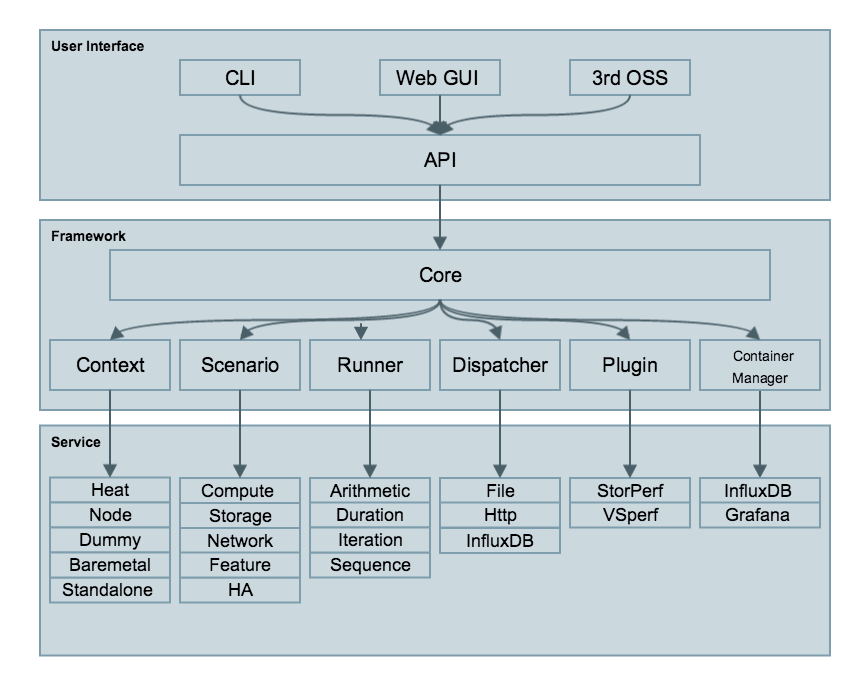

.. This work is licensed under a Creative Commons Attribution 4.0 International
.. License.
.. http://creativecommons.org/licenses/by/4.0
.. (c) 2016 Huawei Technologies Co.,Ltd and others

============
Architecture
============

Abstract
========
This chapter describes the yardstick framework software architecture. we will introduce it from Use-Case View,
Logical View, Process View and Deployment View. More technical details will be introduced in this chapter.

Overview
========

Architecture overview
---------------------
Yardstick is mainly written in Python, and test configurations are made
in YAML. Documentation is written in reStructuredText format, i.e. .rst
files. Yardstick is inspired by Rally. Yardstick is intended to run on a
computer with access and credentials to a cloud. The test case is described
in a configuration file given as an argument.

How it works: the benchmark task configuration file is parsed and converted into
an internal model. The context part of the model is converted into a Heat
template and deployed into a stack. Each scenario is run using a runner, either
serially or in parallel. Each runner runs in its own subprocess executing
commands in a VM using SSH. The output of each scenario is written as json
records to a file or influxdb or http server, we use influxdb as the backend,
the test result will be shown with grafana.

Concept
-------
**Benchmark** - assess the relative performance of something

**Benchmark** configuration file - describes a single test case in yaml format

**Context** - The set of Cloud resources used by a scenario, such as user
names, image names, affinity rules and network configurations. A context is
converted into a simplified Heat template, which is used to deploy onto the
Openstack environment.

**Data** - Output produced by running a benchmark, written to a file in json format

**Runner** - Logic that determines how a test scenario is run and reported, for
example the number of test iterations, input value stepping and test duration.
Predefined runner types exist for re-usage, see `Runner types`_.

**Scenario** - Type/class of measurement for example Ping, Pktgen, (Iperf, LmBench, ...)

**SLA** - Relates to what result boundary a test case must meet to pass. For
example a latency limit, amount or ratio of lost packets and so on. Action
based on :term:`SLA` can be configured, either just to log (monitor) or to stop
further testing (assert). The :term:`SLA` criteria is set in the benchmark
configuration file and evaluated by the runner.

Runner types
------------

There exists several predefined runner types to choose between when designing
a test scenario:

**Arithmetic:**
Every test run arithmetically steps the specified input value(s) in the
test scenario, adding a value to the previous input value. It is also possible
to combine several input values for the same test case in different
combinations.

Snippet of an Arithmetic runner configuration:
::

  runner:
      type: Arithmetic
      iterators:
      -
        name: stride
        start: 64
        stop: 128
        step: 64

**Duration:**
The test runs for a specific period of time before completed.

Snippet of a Duration runner configuration:
::

  runner:
    type: Duration
    duration: 30

**Sequence:**
The test changes a specified input value to the scenario. The input values
to the sequence are specified in a list in the benchmark configuration file.

Snippet of a Sequence runner configuration:
::

  runner:
    type: Sequence
    scenario_option_name: packetsize
    sequence:
    - 100
    - 200
    - 250

**Iteration:**
Tests are run a specified number of times before completed.

Snippet of an Iteration runner configuration:
::

  runner:
    type: Iteration
    iterations: 2

Use-Case View
=============
Yardstick Use-Case View shows two kinds of users. One is the Tester who will
do testing in cloud, the other is the User who is more concerned with test result
and result analyses.

For testers, they will run a single test case or test case suite to verify
infrastructure compliance or bencnmark their own infrastructure performance.
Test result will be stored by dispatcher module, three kinds of store method
(file, influxdb and http) can be configured. The detail information of
scenarios and runners can be queried with CLI by testers.

For users, they would check test result with four ways.

If dispatcher module is configured as file(default), there are two ways to
check test result. One is to get result from yardstick.out ( default path:
/tmp/yardstick.out), the other is to get plot of test result, it will be shown
if users execute command "yardstick-plot".

If dispatcher module is configured as influxdb, users will check test
result on Grafana which is most commonly used for visualizing time series data.

If dispatcher module is configured as http, users will check test result
on OPNFV testing dashboard which use MongoDB as backend.

.. image:: images/Use_case.png
   :width: 800px
   :alt: Yardstick Use-Case View

Logical View
============
Yardstick Logical View describes the most important classes, their
organization, and the most important use-case realizations.

Main classes:

**TaskCommands** - "yardstick task" subcommand handler.

**HeatContext** - Do test yaml file context section model convert to HOT,
deploy and undeploy Openstack heat stack.

**Runner** - Logic that determines how a test scenario is run and reported.

**TestScenario** - Type/class of measurement for example Ping, Pktgen, (Iperf,
LmBench, ...)

**Dispatcher** - Choose user defined way to store test results.

TaskCommands is the "yardstick task" subcommand's main entry. It takes yaml
file (e.g. test.yaml) as input, and uses HeatContext to convert the yaml
file's context section to HOT. After Openstack heat stack is deployed by
HeatContext with the converted HOT, TaskCommands use Runner to run specified
TestScenario. During first runner initialization, it will create output
process. The output process use Dispatcher to push test results. The Runner
will also create a process to execute TestScenario. And there is a
multiprocessing queue between each runner process and output process, so the
runner process can push the real-time test results to the storage media.
TestScenario is commonly connected with VMs by using ssh. It sets up VMs and
run test measurement scripts through the ssh tunnel. After all TestScenaio
is finished, TaskCommands will undeploy the heat stack. Then the whole test is
finished.

Process View (Test execution flow)
==================================
Yardstick process view shows how yardstick runs a test case. Below is the
sequence graph about the test execution flow using heat context, and each
object represents one module in yardstick:

.. image:: images/test_execution_flow.png
   :width: 800px
   :alt: Yardstick Process View

A user wants to do a test with yardstick. He can use the CLI to input the
command to start a task. "TaskCommands" will receive the command and ask
"HeatContext" to parse the context. "HeatContext" will then ask "Model" to
convert the model. After the model is generated, "HeatContext" will inform
"Openstack" to deploy the heat stack by heat template. After "Openstack"
deploys the stack, "HeatContext" will inform "Runner" to run the specific test
case.

Firstly, "Runner" would ask "TestScenario" to process the specific scenario.
Then "TestScenario" will start to log on the openstack by ssh protocal and
execute the test case on the specified VMs. After the script execution
finishes, "TestScenario" will send a message to inform "Runner". When the
testing job is done, "Runner" will inform "Dispatcher" to output the test
result via file, influxdb or http. After the result is output, "HeatContext"
will call "Openstack" to undeploy the heat stack. Once the stack is
undepoyed, the whole test ends.

Deployment View
===============
Yardstick deployment view shows how the yardstick tool can be deployed into the
underlying platform. Generally, yardstick tool is installed on JumpServer(see
`07-installation` for detail installation steps), and JumpServer is
connected with other control/compute servers by networking. Based on this
deployment, yardstick can run the test cases on these hosts, and get the test
result for better showing.

.. image:: images/Deployment.png
   :width: 800px
   :alt: Yardstick Deployment View

Yardstick Directory structure
=============================

**yardstick/** - Yardstick main directory.

*tests/ci/* - Used for continuous integration of Yardstick at different PODs and
        with support for different installers.

*docs/* - All documentation is stored here, such as configuration guides,
          user guides and Yardstick descriptions.

*etc/* - Used for test cases requiring specific POD configurations.

*samples/* - test case samples are stored here, most of all scenario and
             feature's samples are shown in this directory.

*tests/* - Here both Yardstick internal tests (*functional/* and *unit/*) as
           well as the test cases run to verify the NFVI (*opnfv/*) are stored.
           Also configurations of what to run daily and weekly at the different
           PODs is located here.

*tools/* - Currently contains tools to build image for VMs which are deployed
           by Heat. Currently contains how to build the yardstick-trusty-server
           image with the different tools that are needed from within the image.

*plugin/* - Plug-in configuration files are stored here.

*vTC/* - Contains the files for running the virtual Traffic Classifier tests.

*yardstick/* - Contains the internals of Yardstick: Runners, Scenario, Contexts,
               CLI parsing, keys, plotting tools, dispatcher, plugin
               install/remove scripts and so on.

