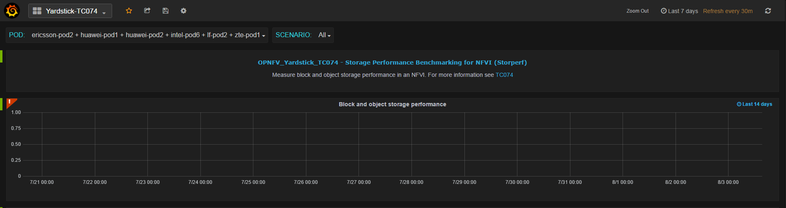

.. This work is licensed under a Creative Commons Attribution 4.0 International
.. License.
.. http://creativecommons.org/licenses/by/4.0
.. (c) OPNFV, 2016 Huawei Technologies Co.,Ltd and others.

==============================================
Store Other Project's Test Results in InfluxDB
==============================================

Abstract
========

.. _Framework: https://wiki.opnfv.org/download/attachments/6827660/wiki.png?version=1&modificationDate=1470298075000&api=v2

This chapter illustrates how to run plug-in test cases and store test results
into community's InfluxDB. The framework is shown in Framework_.

.. image:: images/InfluxDB_store.png
   :width: 800px
   :alt: Store Other Project's Test Results in InfluxDB

Store Storperf Test Results into Community's InfluxDB
=====================================================

.. _Influxdb: https://git.opnfv.org/cgit/yardstick/tree/yardstick/dispatcher/influxdb.py
.. _Mingjiang: limingjiang@huawei.com
.. _Visual: https://wiki.opnfv.org/download/attachments/6827660/tc074.PNG?version=1&modificationDate=1470298075000&api=v2
.. _Login: http://testresults.opnfv.org/grafana/login

As shown in Framework_, there are two ways to store Storperf test results
into community's InfluxDB:

1. Yardstick executes Storperf test case (TC074), posting test job to Storperf
   container via ReST API. After the test job is completed, Yardstick reads
   test results via ReST API from Storperf and posts test data to the influxDB.

2. Additionally, Storperf can run tests by itself and post the test result
   directly to the InfluxDB. The method for posting data directly to influxDB
   will be supported in the future.

Our plan is to support rest-api in D release so that other testing projects can
call the rest-api to use yardstick dispatcher service to push data to yardstick's
influxdb database.

For now, influxdb only support line protocol, and the json protocol is deprecated.

Take ping test case for example, the raw_result is json format like this:
::

    "benchmark": {
        "timestamp": 1470315409.868095,
        "errors": "",
        "data": {
          "rtt": {
          "ares": 1.125
          }
        },
      "sequence": 1
      },
    "runner_id": 2625
  }

With the help of "influxdb_line_protocol", the json is transform to like below as a line string:
::

  'ping,deploy_scenario=unknown,host=athena.demo,installer=unknown,pod_name=unknown,
    runner_id=2625,scenarios=Ping,target=ares.demo,task_id=77755f38-1f6a-4667-a7f3-
      301c99963656,version=unknown rtt.ares=1.125 1470315409868094976'

So, for data output of json format, you just need to transform json into line format and call
influxdb api to post the data into the database. All this function has been implemented in Influxdb_.
If you need support on this, please contact Mingjiang_.
::

  curl -i -XPOST 'http://104.197.68.199:8086/write?db=yardstick' --
    data-binary 'ping,deploy_scenario=unknown,host=athena.demo,installer=unknown, ...'

Grafana will be used for visualizing the collected test data, which is shown in Visual_. Grafana
can be accessed by Login_.

