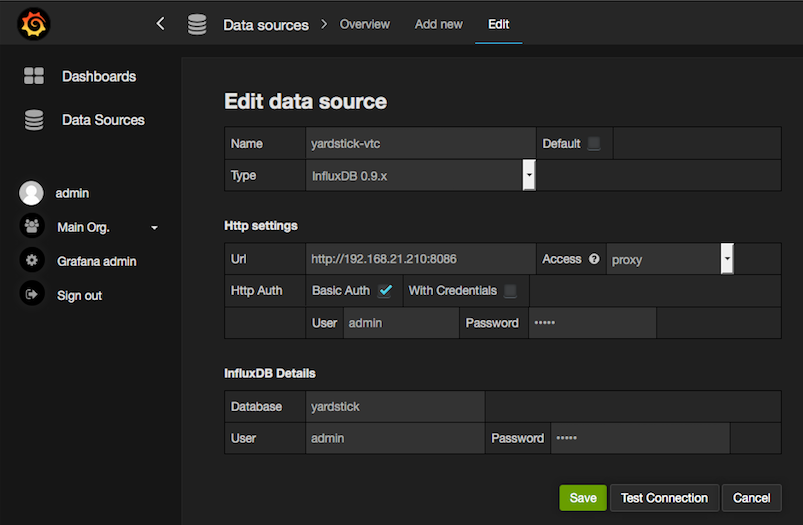

.. This work is licensed under a Creative Commons Attribution 4.0 International
.. License.
.. http://creativecommons.org/licenses/by/4.0
.. (c) OPNFV, Ericsson AB, Huawei Technologies Co.,Ltd and others.

Yardstick Installation
======================

Abstract
--------

Yardstick supports installation on Ubuntu 14.04 or by using a Docker image.
The installation procedure on Ubuntu 14.04 or via the docker image are
detailed in the section below

To use Yardstick you should have access to an OpenStack environment,
with at least Nova, Neutron, Glance, Keystone and Heat installed.

The steps needed to run Yardstick are:

1. Install Yardstick.
2. Create the test configuration .yaml file.
3. Build a guest image。
4 .Load the image into the OpenStack environment.
5. Create a Neutron external network.
6. Load OpenStack environment variables.
6. Run the test case.

Installing Yardstick on Ubuntu 14.04
------------------------------------

.. _install-framework:

You can install Yardstick framework directly on Ubuntu 14.04 or in an Ubuntu
14.04 Docker image.
No matter which way you choose to install Yardstick framework, the following
installation steps are identical.
If you choose to use the Ubuntu 14.04 Docker image, You can pull the Ubuntu
14.04 Docker image from Docker hub:

::

  docker pull ubuntu:14.04

Installing Yardstick framework
^^^^^^^^^^^^^^^^^^^^^^^^^^^^^^
Install dependencies:

::

  sudo apt-get update && sudo apt-get install -y \
      wget \
      git \
      sshpass \
      qemu-utils \
      kpartx \
      libffi-dev \
      libssl-dev \
      python \
      python-dev \
      python-virtualenv \
      libxml2-dev \
      libxslt1-dev \
      python-setuptools

Create a python virtual environment, source it and update setuptools:

::

  virtualenv ~/yardstick_venv
  source ~/yardstick_venv/bin/activate
  easy_install -U setuptools

Download source code and install python dependencies:

::

  git clone https://gerrit.opnfv.org/gerrit/yardstick
  cd yardstick
  python setup.py install

A Youtube video tutorial on this installation mode is available
at: http://www.youtube.com/watch?v=4S4izNolmR0

.. image:: http://img.youtube.com/vi/4S4izNolmR0/0.jpg
   :alt: http://www.youtube.com/watch?v=4S4izNolmR0
   :target: http://www.youtube.com/watch?v=4S4izNolmR0

.. _guest-image:

Building a guest image
^^^^^^^^^^^^^^^^^^^^^^
Yardstick includes tools to run test cases supported by Yardstick. It is
necessary to have sudo rights to use this tool.

Also you may need install several additional packages to use this tool, by
follwing the commands below:

::

  apt-get update && apt-get install -y \
      qemu-utils \
      kpartx

This image can be built using the following command while in the directory where
Yardstick is installed (``~/yardstick`` if the framework is installed
by following the commands above):

::

  sudo ./tools/yardstick-img-modify tools/ubuntu-server-cloudimg-modify.sh

**Warning:** the script will create files by default in:
``/tmp/workspace/yardstick`` and the files will be owned by root!

The created image can be added to OpenStack using the ``glance image-create`` or
via the OpenStack Dashboard.

Example command:

::

  glance --os-image-api-version 1 image-create \
  --name yardstick-trusty-server --is-public true \
  --disk-format qcow2 --container-format bare \
  --file /tmp/workspace/yardstick/yardstick-trusty-server.img

Installing Yardstick using Docker
---------------------------------

Yardstick iteself has a Docker image, this Docker image (**Yardstick-stable**)
serves as a replacement for installing the Yardstick framework in a virtual
environment (for example as done in :ref:`install-framework`).
It is recommended to use this Docker image to run Yardstick test.

Yardstick-stable image
^^^^^^^^^^^^^^^^^^^^^^
Pull the Yardstick-stable Docker image from Docker hub:

::

  docker pull opnfv/yardstick:stable

Run the Docker image:

::

  docker run \
   --privileged=true \
    --rm \
    -t \
    -e "INSTALLER_TYPE=${INSTALLER_TYPE}" \
    -e "INSTALLER_IP=${INSTALLER_IP}" \
    opnfv/yardstick \
    exec_tests.sh ${YARDSTICK_DB_BACKEND} ${YARDSTICK_SUITE_NAME}

Where ``${INSTALLER_TYPE}`` can be apex, compass, fuel or joid, ``${INSTALLER_IP}``
is the installer master node IP address (i.e. 10.20.0.2 is default for fuel). ``${YARDSTICK_DB_BACKEND}``
is the IP and port number of DB, ``${YARDSTICK_SUITE_NAME}`` is the test suite you want to run.
For more details, please refer to the Jenkins job defined in Releng project, labconfig information
and sshkey are required. See the link
https://git.opnfv.org/cgit/releng/tree/jjb/yardstick/yardstick-ci-jobs.yml.

Note: exec_tests.sh is used for executing test suite here, furthermore, if someone
wants to execute the test suite manually, it can be used as long as the parameters
are configured correct. Another script called run_tests.sh is used for unittest in
Jenkins verify job, in local manaul environment, it is recommended to run before
test suite execuation.

Basic steps performed by the **Yardstick-stable** container:

1. clone yardstick and releng repos
2. setup OS credentials (releng scripts)
3. install yardstick and dependencies
4. build yardstick cloud image and upload it to glance
5. upload cirros-0.3.3 cloud image and ubuntu-14.04 cloud image to glance
6. run yardstick test scenarios
7. cleanup

If someone only wants to execute a single test case, one can log into the yardstick-stable
container first using command:

::

  docker run -it openfv/yardstick /bin/bash

Then in the container run yardstick task command to execute single test case.
Detailed steps about executing Yardstick test case can be found below.

OpenStack parameters and credentials
------------------------------------

Yardstick-flavor
^^^^^^^^^^^^^^^^
Most of the sample test cases in Yardstick are using an OpenStack flavor called
*yardstick-flavor* which deviates from the OpenStack standard m1.tiny flavor by the
disk size - instead of 1GB it has 3GB. Other parameters are the same as in m1.tiny.

Environment variables
^^^^^^^^^^^^^^^^^^^^^
Before running Yardstick it is necessary to export OpenStack environment variables
from the OpenStack *openrc* file (using the ``source`` command) and export the
external network name ``export EXTERNAL_NETWORK="external-network-name"``,
the default name for the external network is ``net04_ext``.

Credential environment variables in the *openrc* file have to include at least:

* OS_AUTH_URL
* OS_USERNAME
* OS_PASSWORD
* OS_TENANT_NAME

Yardstick default key pair
^^^^^^^^^^^^^^^^^^^^^^^^^^
Yardstick uses a SSH key pair to connect to the guest image. This key pair can
be found in the ``resources/files`` directory. To run the ``ping-hot.yaml`` test
sample, this key pair needs to be imported to the OpenStack environment.

Examples and verifying the install
----------------------------------

It is recommended to verify that Yardstick was installed successfully
by executing some simple commands and test samples. Below is an example invocation
of yardstick help command and ping.py test sample:
::

  yardstick –h
  yardstick task start samples/ping.yaml

Each testing tool supported by Yardstick has a sample configuration file.
These configuration files can be found in the **samples** directory.

Default location for the output is ``/tmp/yardstick.out``.

Deploy InfluxDB and Grafana locally
------------------------------------

.. pull docker images

Pull docker images

^^^^^^^^^^^^^^^^^^^^^^^^^^^^^^

::

  docker pull tutum/influxdb
  docker pull grafana/grafana

Run influxdb and config
^^^^^^^^^^^^^^^^^^^^^^^^^^^^^^
Run influxdb
::

  docker run -d --name influxdb \
  -p 8083:8083 -p 8086:8086 --expose 8090 --expose 8099 \
  tutum/influxdb
  docker exec -it influxdb bash

Config influxdb
::

  influx
  >CREATE USER root WITH PASSWORD 'root' WITH ALL PRIVILEGES
  >CREATE DATABASE yardstick;
  >use yardstick;
  >show MEASUREMENTS;

Run grafana and config
^^^^^^^^^^^^^^^^^^^^^^^^^^^^^^
Run grafana
::

  docker run -d --name grafana -p 3000:3000 grafana/grafana

Config grafana
::

  http://{YOUR_IP_HERE}:3000
  log on using admin/admin and config database resource to be {YOUR_IP_HERE}:8086

Config yardstick conf
^^^^^^^^^^^^^^^^^^^^^^^^^^^^^^
cp ./etc/yardstick/yardstick.conf.sample /etc/yardstick/yardstick.conf

vi /etc/yardstick/yardstick.conf
Config yardstick.conf
::

  [DEFAULT]
  debug = True
  dispatcher = influxdb

  [dispatcher_influxdb]
  timeout = 5
  target = http://{YOUR_IP_HERE}:8086
  db_name = yardstick
  username = root
  password = root

Now you can run yardstick test cases and store the results in influxdb
^^^^^^^^^^^^^^^^^^^^^^^^^^^^^^

Create a test suite for yardstick
------------------------------------

A test suite in yardstick is a yaml file which include one or more test cases.
Yardstick is able to support running test suite task, so you can customize you
own test suite and run it in one task.

"tests/opnfv/test_suites" is where yardstick put ci test-suite. A typical test
suite is like below:

fuel_test_suite.yaml

::

  ---
  # Fuel integration test task suite

  schema: "yardstick:suite:0.1"

  name: "fuel_test_suite"
  test_cases_dir: "samples/"
  test_cases:
  -
    file_name: ping.yaml
  -
    file_name: iperf3.yaml

As you can see, there are two test cases in fuel_test_suite, the syntax is simple
here, you must specify the schema and the name, then you just need to list the
test cases in the tag "test_cases" and also mark their relative directory in the
tag "test_cases_dir".

Yardstick test suite also support constraints and task args for each test suite.
Here is another sample to show this, which is digested from one big test suite.

os-nosdn-nofeature-ha.yaml

::

 ---

 schema: "yardstick:suite:0.1"

 name: "os-nosdn-nofeature-ha"
 test_cases_dir: "tests/opnfv/test_cases/"
 test_cases:
 -
     file_name: opnfv_yardstick_tc002.yaml
 -
     file_name: opnfv_yardstick_tc005.yaml
 -
     file_name: opnfv_yardstick_tc043.yaml
        constraint:
           installer: compass
           pod: huawei-pod1
        task_args:
           huawei-pod1: '{"pod_info": "etc/yardstick/.../pod.yaml",
           "host": "node4.LF","target": "node5.LF"}'

As you can see in test case "opnfv_yardstick_tc043.yaml", there are two tags, "constraint" and
"task_args". "constraint" is where you can specify which installer or pod it can be run in
the ci environment. "task_args" is where you can specify the task arguments for each pod.

All in all, to create a test suite in yardstick, you just need to create a suite yaml file
and add test cases and constraint or task arguments if necessary.

