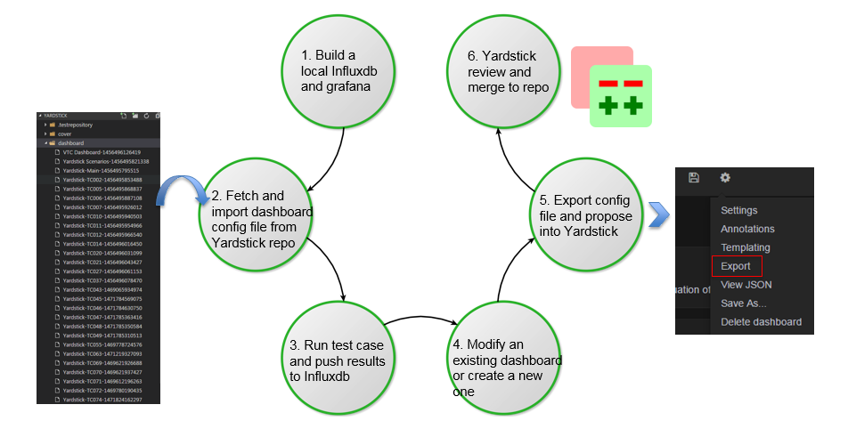

.. This work is licensed under a Creative Commons Attribution 4.0 International
.. License.
.. http://creativecommons.org/licenses/by/4.0
.. (c) 2016 Huawei Technologies Co.,Ltd and others

=================
Grafana dashboard
=================

Abstract
========

This chapter describes the Yardstick grafana dashboard. The Yardstick grafana
dashboard can be found here: http://testresults.opnfv.org/grafana/

.. image:: images/login.png
   :width: 800px
   :alt: Yardstick grafana dashboard

Public access
=============

Yardstick provids a public account for accessing to the dashboard. The username
and password are both set to ‘opnfv’.

Testcase dashboard
==================

For each test case, there is a dedicated dashboard. Shown here is the dashboard
of TC002.

.. image:: images/TC002.png
   :width: 800px
   :alt:TC002 dashboard

For each test case dashboard. On the top left, we have a dashboard selection,
you can switch to different test cases using this pull-down menu.

Underneath, we have a pod and scenario selection.
All the pods and scenarios that have ever published test data to the InfluxDB
will be shown here.

You can check multiple pods or scenarios.

For each test case, we have a short description and a link to detailed test
case information in Yardstick user guide.

Underneath, it is the result presentation section.
You can use the time period selection on the top right corner to zoom in or
zoom out the chart.

Administration access
=====================

For a user with administration rights it is easy to update and save any
dashboard configuration. Saved updates immediately take effect and become live.
This may cause issues like:

- Changes and updates made to the live configuration in Grafana can compromise
  existing Grafana content in an unwanted, unpredicted or incompatible way.
  Grafana as such is not version controlled, there exists one single Grafana
  configuration per dashboard.
- There is a risk several people can disturb each other when doing updates to
  the same Grafana dashboard at the same time.

Any change made by administrator should be careful.

Add a dashboard into yardstick grafana
======================================

Due to security concern, users that using the public opnfv account are not able
to edit the yardstick grafana directly.It takes a few more steps for a
non-yardstick user to add a custom dashboard into yardstick grafana.

There are 6 steps to go.

1. You need to build a local influxdb and grafana, so you can do the work
   locally. You can refer to How to deploy InfluxDB and Grafana locally wiki
   page about how to do this.

2. Once step one is done, you can fetch the existing grafana dashboard
   configuration file from the yardstick repository and import it to your local
   grafana. After import is done, you grafana dashboard will be ready to use
   just like the community’s dashboard.

3. The third step is running some test cases to generate test results and
   publishing it to your local influxdb.

4. Now you have some data to visualize in your dashboard. In the fourth step,
   it is time to create your own dashboard. You can either modify an existing
   dashboard or try to create a new one from scratch. If you choose to modify
   an existing dashboard then in the curtain menu of the existing dashboard do
   a "Save As..." into a new dashboard copy instance, and then continue doing
   all updates and saves within the dashboard copy.

5. When finished with all Grafana configuration changes in this temporary
   dashboard then chose "export" of the updated dashboard copy into a JSON file
   and put it up for review in Gerrit, in file /yardstick/dashboard/Yardstick-TCxxx-yyyyyyyyyyyyy.
   For instance a typical default name of the file would be "Yardstick-TC001 Copy-1234567891234".

6. Once you finish your dashboard, the next step is exporting the configuration
   file and propose a patch into Yardstick. Yardstick team will review and
   merge it into Yardstick repository. After approved review Yardstick team
   will do an "import" of the JSON file and also a "save dashboard" as soon as
   possible to replace the old live dashboard configuration.

